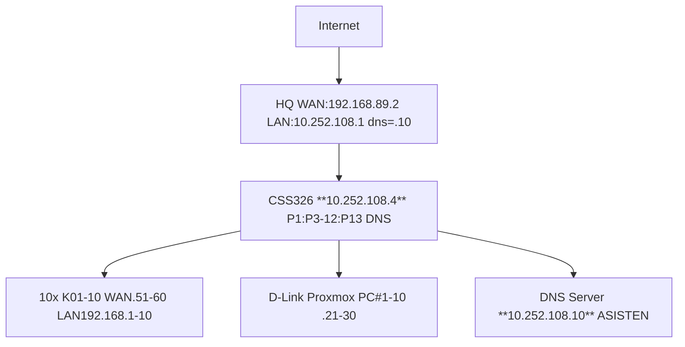

# MINGGU 1: SETUP LAB WORKSHOP ADMINISTRASI SISTEM & JARINGAN
**Durasi: 120 menit** | **10 Kelompok** (4 Kelas Bergilir Proxmox: A=.10 B=.20 C=.30 D=.40) | **Asisten: Core Infra** 

## TOPOLOGI


## PARAMETER LENGKAP 10 KELOMPOK x 4 KELAS
| Kelompok | RB3011 WAN IP     | LAN Subnet/GW          | Proxmox PC IP       | **VM Kelas A** | **VM Kelas B** | **VM Kelas C** | **VM Kelas D** |
|----------|-------------------|------------------------|---------------------|----------------|----------------|----------------|----------------|
| **K01**  | 10.252.108.51/24 | 192.168.1.0/24<br/>GW:192.168.1.1 | 10.252.108.21/24 | **192.168.1.10** | 192.168.1.20 | 192.168.1.30 | 192.168.1.40 |
| **K02**  | 10.252.108.52/24 | 192.168.2.0/24<br/>GW:192.168.2.1 | 10.252.108.22/24 | 192.168.2.10 | **192.168.2.20** | 192.168.2.30 | 192.168.2.40 |
| **K03**  | 10.252.108.53/24 | 192.168.3.0/24<br/>GW:192.168.3.1 | 10.252.108.23/24 | 192.168.3.10 | 192.168.3.20 | **192.168.3.30** | 192.168.3.40 |
| **K04**  | 10.252.108.54/24 | 192.168.4.0/24<br/>GW:192.168.4.1 | 10.252.108.24/24 | 192.168.4.10 | 192.168.4.20 | 192.168.4.30 | **192.168.4.40** |
| **K05**  | 10.252.108.55/24 | 192.168.5.0/24<br/>GW:192.168.5.1 | 10.252.108.25/24 | **192.168.5.10** | 192.168.5.20 | 192.168.5.30 | 192.168.5.40 |
| **K06**  | 10.252.108.56/24 | 192.168.6.0/24<br/>GW:192.168.6.1 | 10.252.108.26/24 | 192.168.6.10 | **192.168.6.20** | 192.168.6.30 | 192.168.6.40 |
| **K07**  | 10.252.108.57/24 | 192.168.7.0/24<br/>GW:192.168.7.1 | 10.252.108.27/24 | 192.168.7.10 | 192.168.7.20 | **192.168.7.30** | 192.168.7.40 |
| **K08**  | 10.252.108.58/24 | 192.168.8.0/24<br/>GW:192.168.8.1 | 10.252.108.28/24 | 192.168.8.10 | 192.168.8.20 | 192.168.8.30 | **192.168.8.40** |
| **K09**  | 10.252.108.59/24 | 192.168.9.0/24<br/>GW:192.168.9.1 | 10.252.108.29/24 | **192.168.9.10** | 192.168.9.20 | 192.168.9.30 | 192.168.9.40 |
| **K10**  | 10.252.108.60/24 | 192.168.10.0/24<br/>GW:192.168.10.1| 10.252.108.30/24 | 192.168.10.10 | **192.168.10.20** | 192.168.10.30 | 192.168.10.40 |

**Bold = VM aktif untuk kelas tersebut** (Kelas A pakai .10 di semua kelompok, dst). **GW semua: sesuai tabel** | **DNS semua: 10.252.108.10** 

## STEP-BY-STEP (Screenshot WAJIB Setiap Test)

### 1. CORE INFRA (ASISTEN 30 menit – JANGAN OPREK)
#### 1.1 RB1100 HQ Gateway
```
Winbox reset no-defaults:
/int bridge add bridge-hq
/int bridge port add bridge=bridge-hq ether2  # CSS P1
/ip addr add 192.168.89.2/24 ether1; add 10.252.108.1/24 bridge-hq
/ip dns servers=10.252.108.10 allow-remote=yes
/ip route gw=192.168.89.1
/ip fw nat srcnat masquerade out=ether1
```
Test: `/ping 8.8.8.8` Screenshot route/nat [help.mikrotik](https://help.mikrotik.com/docs/spaces/ROS/pages/103841826/Basic+VLAN+switching)

#### 1.2 CSS326 Switch (10.252.108.4)
```
http://192.168.88.1 → Reset No Default
Hosts Add: 10.252.108.4/24 GW 10.252.108.1
VLAN Mode: basic | VLAN1 untagged semua
Ports: P1 HQ, P3=K01...P12=K10, P13=DNS PC, P14-23=D-Link Prox
```
Test: http://10.252.108.4 → Ports green Screenshot hosts/ports [wiki.mikrotik](https://wiki.mikrotik.com/SWOS/CSS326-VLAN-Example)

#### 1.3 DNS PC Dedicated (10.252.108.10)
```
Ubuntu: ip addr 10.252.108.10/24 eno1 gw 10.252.108.1
apt bind9 dnsutils
named.conf.options: forwarders{8.8.8.8;}; listen-on{10.252.108.10;}
systemctl restart bind9
```
Test: `dig @10.252.108.10 google.com` [documentation.ubuntu](https://documentation.ubuntu.com/server/how-to/networking/install-dns/)

### 2. RB3011 Kxx BRANCH ROUTER (KELOMPOK 25 menit)
Winbox sesuai tabel [X=WAN akhir 1-0]:
```
/system identity RB3011-K0[X]; /system backup m1-k0[X].backup; /export m1-k0[X].rsc
/int bridge add bridge-lan
/ip addr add 10.252.108.5[X]/24 ether1; add 192.168.[X].1/24 bridge-lan
/ip pool pool-k0[X] 192.168.[X].100-254
/ip dhcp-server add int=bridge-lan pool=pool-k0[X]
/ip dhcp-server network add 192.168.[X].0/24 gw=192.168.[X].1 dns-server=10.252.108.10
/ip dns servers=10.252.108.10 allow-remote=yes
/ip fw nat srcnat masquerade out=ether1 src=192.168.[X].0/24
```
**Test:** `/ping 10.252.108.1`; `/ping 8.8.8.8`; lease print; nslookup Screenshot [help.mikrotik](https://help.mikrotik.com/docs/spaces/ROS/pages/103841826/Basic+VLAN+switching)

### 3. PROXMOX PC#X 10.252.108.2X (KELOMPOK 25 menit)
Install Proxmox → Edit interfaces:
```
auto vmbr0
iface vmbr0 inet static
  address 10.252.108.2X/24
  gateway 10.252.108.1
  bridge-ports eno1
  bridge-stp off
  dns-nameservers 10.252.108.10
```
Test: https://10.252.108.2X:8006; nslookup Screenshot dashboard [servethehome](https://www.servethehome.com/how-to-assign-a-second-ip-address-to-proxmox-ve-hosts/)

### 4. UBUNTU VM srv-[KELAS]-k0[X]-dns (KELOMPOK 35 menit)
Proxmox GUI VM ID=100 **Name=srv-[KELAS]-k0[X]-dns** (ex srv-a-k01-dns):
- 2C/2GB/20GB vmbr0 VirtIO Ubuntu 24.04 ISO  
**Install Static (sesuai tabel bold kelas Anda):**
```
IP: 192.168.[X].[KELAS_ID]/24  (.10=A .20=B .30=C .40=D)
GW: 192.168.[X].1
DNS nameserver: 10.252.108.10
```
Post: `apt openssh-server net-tools htop dnsutils`  
**Test SSH VM (admin@192.168.[X].[KELAS_ID]):**
```
ping -c3 192.168.[X].1; ping 10.252.108.10; ping google.com; nslookup google.com
```
Screenshot ip addr + 4 ping [perplexity](https://www.perplexity.ai/search/2940ff5e-9f43-4618-916e-0c9aa939f716)

## FINAL CHECKLIST (Screenshot Table)
| No | Item | Status | Screenshot File |
|----|------|--------|-----------------|
| 1  | RB backup/.rsc | [ ] | m1-k0X-backup.png |
| 2  | RB lease VM | [ ] | rb-lease.png |
| 3  | Proxmox GUI | [ ] | prox-gui.png |
| 4  | VM SSH ip addr | [ ] | vm-ip.png |
| 5  | VM 4x ping + nslookup | [ ] | vm-test.png |

## TROUBLESHOOT TABLE
| Masalah | Kemungkinan | Fix Cepat |
|---------|-------------|-----------|
| No DHCP VM | dhcp-network | dns-server=10.252.108.10  [help.mikrotik](https://help.mikrotik.com/docs/spaces/ROS/pages/103841826/Basic+VLAN+switching) |
| Proxmox no net | interfaces | dns-nameservers .10 reboot  [servethehome](https://www.servethehome.com/how-to-assign-a-second-ip-address-to-proxmox-ve-hosts/) |
| CSS .4 down | Hosts | Asisten cable P24 gw .1  [wiki.mikrotik](https://wiki.mikrotik.com/SWOS/CSS326-VLAN-Example) |
| DNS .10 no forward | BIND | Asisten named.conf forwarders  [documentation.ubuntu](https://documentation.ubuntu.com/server/how-to/networking/install-dns/) |

**LAPORAN:** PDF 5 screenshot + jawab "Alur VM ke Internet?"  
**End MINGGU_1** 🎉 Backbone ready services! [perplexity](https://www.perplexity.ai/search/cfab4913-0802-48a9-ae12-6d47b884cd68)
