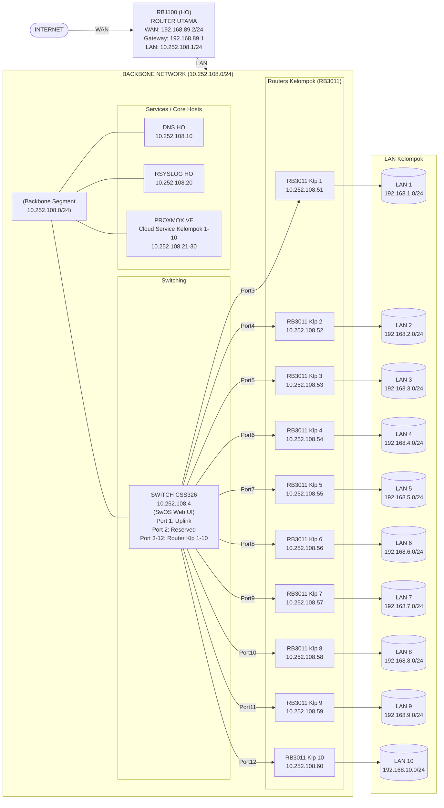

# WORKSHOP ADMINISTRASI JARINGAN 2026
## Minggu 1: Setup Laboratorium - 6 Kelas (10 Kelompok/Kelas)

**Dokumen Revisi:** v2.2  
**Tanggal:** Februari 2026  


---

## DAFTAR ISI

1. [Topologi Jaringan](#1-topologi-jaringan)
2. [Skema IP Address](#2-skema-ip-address)
3. [Alokasi VLAN per Kelas](#3-alokasi-vlan-per-kelas)
4. [Konfigurasi Switch CSS326 (SwOS Web UI)](#4-konfigurasi-switch-css326-swos-web-ui)
5. [Konfigurasi Router RB3011](#5-konfigurasi-router-rb3011)
6. [Template Netplan Ubuntu](#6-template-netplan-ubuntu)
7. [Verifikasi dan Troubleshooting](#7-verifikasi-dan-troubleshooting)
8. [Referensi Cepat per Kelompok](#8-referensi-cepat-per-kelompok)

---

## 1. TOPOLOGI JARINGAN

### 1.1 Diagram Topologi Backbone



### 1.2 Komponen Infrastruktur

| Perangkat | Fungsi | IP Address | Keterangan |
|-----------|--------|------------|------------|
| RB1100 (HO) | Router Gateway Utama | LAN: 10.252.108.1/24, WAN: 192.168.89.2/24 | Gateway ke Internet |
| CSS326 | Managed Switch (SwOS) | 10.252.108.4/24 | VLAN Trunking, Web UI only |
| DNS Server HO | DNS Internal | 10.252.108.10/24 | DNS Resolver |
| RSYSLOG Server HO | Log Collector | 10.252.108.20/24 | Centralized Logging |
| Proxmox VE (Klp 1-10) | Cloud Service / VM Host | 10.252.108.21-30/24 | Virtual Machine Platform |
| RB3011 (Klp 1-10) | Router Kelompok | WAN: 10.252.108.51-60/24 | Masing-masing kelompok |

---

## 2. SKEMA IP ADDRESS

### 2.1 Network Backbone (10.252.108.0/24)

| Alamat IP | Fungsi | Gateway |
|-----------|--------|---------|
| 10.252.108.1 | RB1100 Gateway HO | - |
| 10.252.108.4 | Switch CSS326 | 10.252.108.1 |
| 10.252.108.10 | DNS Server HO | 10.252.108.1 |
| 10.252.108.20 | RSYSLOG Server HO | 10.252.108.1 |
| 10.252.108.21 | Proxmox VE Kelompok 1 | 10.252.108.1 |
| 10.252.108.22 | Proxmox VE Kelompok 2 | 10.252.108.1 |
| 10.252.108.23 | Proxmox VE Kelompok 3 | 10.252.108.1 |
| 10.252.108.24 | Proxmox VE Kelompok 4 | 10.252.108.1 |
| 10.252.108.25 | Proxmox VE Kelompok 5 | 10.252.108.1 |
| 10.252.108.26 | Proxmox VE Kelompok 6 | 10.252.108.1 |
| 10.252.108.27 | Proxmox VE Kelompok 7 | 10.252.108.1 |
| 10.252.108.28 | Proxmox VE Kelompok 8 | 10.252.108.1 |
| 10.252.108.29 | Proxmox VE Kelompok 9 | 10.252.108.1 |
| 10.252.108.30 | Proxmox VE Kelompok 10 | 10.252.108.1 |
| 10.252.108.51 | RB3011 Kelompok 1 WAN | 10.252.108.1 |
| 10.252.108.52 | RB3011 Kelompok 2 WAN | 10.252.108.1 |
| 10.252.108.53 | RB3011 Kelompok 3 WAN | 10.252.108.1 |
| 10.252.108.54 | RB3011 Kelompok 4 WAN | 10.252.108.1 |
| 10.252.108.55 | RB3011 Kelompok 5 WAN | 10.252.108.1 |
| 10.252.108.56 | RB3011 Kelompok 6 WAN | 10.252.108.1 |
| 10.252.108.57 | RB3011 Kelompok 7 WAN | 10.252.108.1 |
| 10.252.108.58 | RB3011 Kelompok 8 WAN | 10.252.108.1 |
| 10.252.108.59 | RB3011 Kelompok 9 WAN | 10.252.108.1 |
| 10.252.108.60 | RB3011 Kelompok 10 WAN | 10.252.108.1 |

### 2.2 Ringkasan Alokasi IP Backbone

| Range IP | Fungsi | Jumlah |
|----------|--------|--------|
| 10.252.108.1 | Gateway RB1100 | 1 |
| 10.252.108.4 | Switch CSS326 | 1 |
| 10.252.108.10 | DNS Server | 1 |
| 10.252.108.20 | RSYSLOG Server | 1 |
| 10.252.108.21-30 | Proxmox VE (Kelompok 1-10) | 10 |
| 10.252.108.51-60 | Router RB3011 WAN (Kelompok 1-10) | 10 |

### 2.3 Network LAN Kelompok (192.168.X.0/24)

| Kelompok | Network LAN | Gateway Router | Range DHCP |
|----------|-------------|----------------|------------|
| 1 | 192.168.1.0/24 | 192.168.1.1 | 192.168.1.100-200 |
| 2 | 192.168.2.0/24 | 192.168.2.1 | 192.168.2.100-200 |
| 3 | 192.168.3.0/24 | 192.168.3.1 | 192.168.3.100-200 |
| 4 | 192.168.4.0/24 | 192.168.4.1 | 192.168.4.100-200 |
| 5 | 192.168.5.0/24 | 192.168.5.1 | 192.168.5.100-200 |
| 6 | 192.168.6.0/24 | 192.168.6.1 | 192.168.6.100-200 |
| 7 | 192.168.7.0/24 | 192.168.7.1 | 192.168.7.100-200 |
| 8 | 192.168.8.0/24 | 192.168.8.1 | 192.168.8.100-200 |
| 9 | 192.168.9.0/24 | 192.168.9.1 | 192.168.9.100-200 |
| 10 | 192.168.10.0/24 | 192.168.10.1 | 192.168.10.100-200 |

---

## 3. ALOKASI VLAN PER KELAS

### 3.1 Tabel VLAN ID

| Kelas | Klp 1 | Klp 2 | Klp 3 | Klp 4 | Klp 5 | Klp 6 | Klp 7 | Klp 8 | Klp 9 | Klp 10 |
|-------|-------|-------|-------|-------|-------|-------|-------|-------|-------|--------|
| **A** | 51 | 52 | 53 | 54 | 55 | 56 | 57 | 58 | 59 | 60 |
| **B** | 61 | 62 | 63 | 64 | 65 | 66 | 67 | 68 | 69 | 70 |
| **C** | 71 | 72 | 73 | 74 | 75 | 76 | 77 | 78 | 79 | 80 |
| **D** | 81 | 82 | 83 | 84 | 85 | 86 | 87 | 88 | 89 | 90 |
| **E** | 91 | 92 | 93 | 94 | 95 | 96 | 97 | 98 | 99 | 100 |
| **F** | 101 | 102 | 103 | 104 | 105 | 106 | 107 | 108 | 109 | 110 |

### 3.2 Formula Perhitungan VLAN ID

```
VLAN_ID = BASE_VLAN + (Nomor_Kelompok - 1)

Dimana BASE_VLAN:
- Kelas A: 51
- Kelas B: 61
- Kelas C: 71
- Kelas D: 81
- Kelas E: 91
- Kelas F: 101

Contoh: Kelas C, Kelompok 5
VLAN_ID = 71 + (5 - 1) = 75
```

---

## 4. KONFIGURASI SWITCH CSS326 (SwOS Web UI)

> **PENTING:** MikroTik CSS326 menggunakan **SwOS** (bukan RouterOS).  
> Konfigurasi **HANYA** dapat dilakukan melalui **Web Browser UI**.  
> Tidak ada akses CLI/Terminal.

### 4.1 Akses Awal ke SwOS Web UI

#### Langkah 1: Persiapan Koneksi

1. Hubungkan laptop/PC ke salah satu port CSS326 (misalnya Port 1)
2. Set IP laptop secara manual:
   - IP Address: `192.168.88.2`
   - Subnet Mask: `255.255.255.0`
   - Gateway: `192.168.88.1`

#### Langkah 2: Login ke Web UI

1. Buka browser (Chrome/Firefox recommended)
2. Akses: `http://192.168.88.1`
3. Login dengan kredensial default:
   - **Username:** `admin`
   - **Password:** *(kosong/blank)*

#### Langkah 3: Reset Factory (Jika Diperlukan)

Jika switch sudah terkonfigurasi sebelumnya:
1. Tekan dan tahan tombol **Reset** selama **5 detik** saat switch menyala
2. Tunggu LED berkedip, lalu lepas
3. Switch akan restart dengan konfigurasi default

---

### 4.2 Konfigurasi System (Tab: System)

Setelah login, klik tab **"System"** di menu atas.

#### Setting yang Perlu Diubah:

| Parameter | Nilai | Keterangan |
|-----------|-------|------------|
| **Identity** | `CSS326-LAB-WORKSHOP` | Nama switch |
| **IP Address** | `10.252.108.4` | IP management |
| **Netmask** | `255.255.255.0` | /24 |
| **Gateway** | `10.252.108.1` | Gateway ke RB1100 |
| **Allow From** | `0.0.0.0/0` | Izinkan akses dari semua IP |
| **Password** | `[Set password kuat]` | Ganti password admin |

**Langkah:**
1. Isi field sesuai tabel di atas
2. Klik **"Apply"** di bagian bawah halaman
3. Akses ulang switch via IP baru: `http://10.252.108.4`

> ⚠️ **PERHATIAN:** Setelah mengubah IP, pastikan laptop Anda juga diubah ke subnet yang sama (10.252.108.x) atau terhubung ke jaringan backbone.

---

### 4.3 Konfigurasi VLAN (Tab: VLAN)

Klik tab **"VLAN"** di menu atas. SwOS CSS326 menggunakan **VLAN Table** dan **Port VLAN settings**.

#### 4.3.1 Aktifkan VLAN Mode

Di bagian atas halaman VLAN:

| Parameter | Nilai |
|-----------|-------|
| **VLAN Mode** | `Enabled` atau `Strict` |
| **VLAN Receive** | `only tagged` untuk trunk, `only untagged` untuk access |

#### 4.3.2 Membuat VLAN Database

Pada SwOS, VLAN dibuat dengan menambahkan **VLAN ID** ke tabel dan menentukan **port membership**.

**Struktur VLAN Table di SwOS:**

```
┌─────────┬────────┬────────┬────────┬────────┬─────┬─────────┐
│ VLAN ID │ Port 1 │ Port 2 │ Port 3 │ Port 4 │ ... │ Port 24 │
├─────────┼────────┼────────┼────────┼────────┼─────┼─────────┤
│   51    │   T    │   -    │   U    │   -    │     │         │
│   52    │   T    │   -    │   -    │   U    │     │         │
│   ...   │        │        │        │        │     │         │
└─────────┴────────┴────────┴────────┴────────┴─────┴─────────┘

Keterangan:
T = Tagged (Trunk) - Frame keluar dengan VLAN tag
U = Untagged (Access) - Frame keluar tanpa VLAN tag
- = Not Member - Port bukan anggota VLAN ini
```

---

### 4.4 Konfigurasi VLAN per Kelas (Step-by-Step Web UI)

#### PERSIAPAN: Setting Port Uplink (Port 1)

Port 1 adalah **TRUNK** ke RB1100, harus membawa semua VLAN.

---

### KONFIGURASI UNTUK KELAS A (VLAN 51-60)

Pada halaman **VLAN**, buat entri VLAN dan set port membership:

#### Tabel VLAN Kelas A:

| VLAN ID | Port 1 | Port 2 | Port 3 | Port 4 | Port 5 | Port 6 | Port 7 | Port 8 | Port 9 | Port 10 | Port 11 | Port 12 |
|---------|--------|--------|--------|--------|--------|--------|--------|--------|--------|---------|---------|---------|
| **51** | T | - | **U** | - | - | - | - | - | - | - | - | - |
| **52** | T | - | - | **U** | - | - | - | - | - | - | - | - |
| **53** | T | - | - | - | **U** | - | - | - | - | - | - | - |
| **54** | T | - | - | - | - | **U** | - | - | - | - | - | - |
| **55** | T | - | - | - | - | - | **U** | - | - | - | - | - |
| **56** | T | - | - | - | - | - | - | **U** | - | - | - | - |
| **57** | T | - | - | - | - | - | - | - | **U** | - | - | - |
| **58** | T | - | - | - | - | - | - | - | - | **U** | - | - |
| **59** | T | - | - | - | - | - | - | - | - | - | **U** | - |
| **60** | T | - | - | - | - | - | - | - | - | - | - | **U** |

**Keterangan Kolom:**
- **T** = Tagged (klik sampai muncul "T")
- **U** = Untagged (klik sampai muncul "U") 
- **-** = Not member (kosong/strip)

#### Langkah di Web UI untuk Kelas A:

1. **Buka tab VLAN**
2. **Tambah VLAN 51:**
   - Scroll ke baris kosong atau klik "Add New"
   - Masukkan VLAN ID: `51`
   - Klik kolom Port 1 → pilih **"T"** (Tagged)
   - Klik kolom Port 3 → pilih **"U"** (Untagged)
   - Kolom lain biarkan **"-"** (Not member)
3. **Ulangi untuk VLAN 52-60** sesuai tabel di atas
4. **Klik "Apply"** untuk menyimpan

#### Setting PVID (Default VLAN) Kelas A:

Pada bagian **Port VLAN** atau **Ports** tab, set PVID untuk setiap port:

| Port | PVID | VLAN Mode | Keterangan |
|------|------|-----------|------------|
| Port 1 | 1 | Trunk (All Tagged) | Uplink ke RB1100 |
| Port 2 | 1 | - | Reserved |
| Port 3 | 51 | Access | Kelompok 1 |
| Port 4 | 52 | Access | Kelompok 2 |
| Port 5 | 53 | Access | Kelompok 3 |
| Port 6 | 54 | Access | Kelompok 4 |
| Port 7 | 55 | Access | Kelompok 5 |
| Port 8 | 56 | Access | Kelompok 6 |
| Port 9 | 57 | Access | Kelompok 7 |
| Port 10 | 58 | Access | Kelompok 8 |
| Port 11 | 59 | Access | Kelompok 9 |
| Port 12 | 60 | Access | Kelompok 10 |

---

### KONFIGURASI UNTUK KELAS B (VLAN 61-70)

#### Tabel VLAN Kelas B:

| VLAN ID | Port 1 | Port 3 | Port 4 | Port 5 | Port 6 | Port 7 | Port 8 | Port 9 | Port 10 | Port 11 | Port 12 |
|---------|--------|--------|--------|--------|--------|--------|--------|--------|---------|---------|---------|
| **61** | T | **U** | - | - | - | - | - | - | - | - | - |
| **62** | T | - | **U** | - | - | - | - | - | - | - | - |
| **63** | T | - | - | **U** | - | - | - | - | - | - | - |
| **64** | T | - | - | - | **U** | - | - | - | - | - | - |
| **65** | T | - | - | - | - | **U** | - | - | - | - | - |
| **66** | T | - | - | - | - | - | **U** | - | - | - | - |
| **67** | T | - | - | - | - | - | - | **U** | - | - | - |
| **68** | T | - | - | - | - | - | - | - | **U** | - | - |
| **69** | T | - | - | - | - | - | - | - | - | **U** | - |
| **70** | T | - | - | - | - | - | - | - | - | - | **U** |

#### Setting PVID Kelas B:

| Port | PVID |
|------|------|
| Port 3 | 61 |
| Port 4 | 62 |
| Port 5 | 63 |
| Port 6 | 64 |
| Port 7 | 65 |
| Port 8 | 66 |
| Port 9 | 67 |
| Port 10 | 68 |
| Port 11 | 69 |
| Port 12 | 70 |

---

### KONFIGURASI UNTUK KELAS C (VLAN 71-80)

#### Tabel VLAN Kelas C:

| VLAN ID | Port 1 | Port 3 | Port 4 | Port 5 | Port 6 | Port 7 | Port 8 | Port 9 | Port 10 | Port 11 | Port 12 |
|---------|--------|--------|--------|--------|--------|--------|--------|--------|---------|---------|---------|
| **71** | T | **U** | - | - | - | - | - | - | - | - | - |
| **72** | T | - | **U** | - | - | - | - | - | - | - | - |
| **73** | T | - | - | **U** | - | - | - | - | - | - | - |
| **74** | T | - | - | - | **U** | - | - | - | - | - | - |
| **75** | T | - | - | - | - | **U** | - | - | - | - | - |
| **76** | T | - | - | - | - | - | **U** | - | - | - | - |
| **77** | T | - | - | - | - | - | - | **U** | - | - | - |
| **78** | T | - | - | - | - | - | - | - | **U** | - | - |
| **79** | T | - | - | - | - | - | - | - | - | **U** | - |
| **80** | T | - | - | - | - | - | - | - | - | - | **U** |

#### Setting PVID Kelas C:

| Port | PVID |
|------|------|
| Port 3 | 71 |
| Port 4 | 72 |
| Port 5 | 73 |
| Port 6 | 74 |
| Port 7 | 75 |
| Port 8 | 76 |
| Port 9 | 77 |
| Port 10 | 78 |
| Port 11 | 79 |
| Port 12 | 80 |

---

### KONFIGURASI UNTUK KELAS D (VLAN 81-90)

#### Tabel VLAN Kelas D:

| VLAN ID | Port 1 | Port 3 | Port 4 | Port 5 | Port 6 | Port 7 | Port 8 | Port 9 | Port 10 | Port 11 | Port 12 |
|---------|--------|--------|--------|--------|--------|--------|--------|--------|---------|---------|---------|
| **81** | T | **U** | - | - | - | - | - | - | - | - | - |
| **82** | T | - | **U** | - | - | - | - | - | - | - | - |
| **83** | T | - | - | **U** | - | - | - | - | - | - | - |
| **84** | T | - | - | - | **U** | - | - | - | - | - | - |
| **85** | T | - | - | - | - | **U** | - | - | - | - | - |
| **86** | T | - | - | - | - | - | **U** | - | - | - | - |
| **87** | T | - | - | - | - | - | - | **U** | - | - | - |
| **88** | T | - | - | - | - | - | - | - | **U** | - | - |
| **89** | T | - | - | - | - | - | - | - | - | **U** | - |
| **90** | T | - | - | - | - | - | - | - | - | - | **U** |

#### Setting PVID Kelas D:

| Port | PVID |
|------|------|
| Port 3 | 81 |
| Port 4 | 82 |
| Port 5 | 83 |
| Port 6 | 84 |
| Port 7 | 85 |
| Port 8 | 86 |
| Port 9 | 87 |
| Port 10 | 88 |
| Port 11 | 89 |
| Port 12 | 90 |

---

### KONFIGURASI UNTUK KELAS E (VLAN 91-100)

#### Tabel VLAN Kelas E:

| VLAN ID | Port 1 | Port 3 | Port 4 | Port 5 | Port 6 | Port 7 | Port 8 | Port 9 | Port 10 | Port 11 | Port 12 |
|---------|--------|--------|--------|--------|--------|--------|--------|--------|---------|---------|---------|
| **91** | T | **U** | - | - | - | - | - | - | - | - | - |
| **92** | T | - | **U** | - | - | - | - | - | - | - | - |
| **93** | T | - | - | **U** | - | - | - | - | - | - | - |
| **94** | T | - | - | - | **U** | - | - | - | - | - | - |
| **95** | T | - | - | - | - | **U** | - | - | - | - | - |
| **96** | T | - | - | - | - | - | **U** | - | - | - | - |
| **97** | T | - | - | - | - | - | - | **U** | - | - | - |
| **98** | T | - | - | - | - | - | - | - | **U** | - | - |
| **99** | T | - | - | - | - | - | - | - | - | **U** | - |
| **100** | T | - | - | - | - | - | - | - | - | - | **U** |

#### Setting PVID Kelas E:

| Port | PVID |
|------|------|
| Port 3 | 91 |
| Port 4 | 92 |
| Port 5 | 93 |
| Port 6 | 94 |
| Port 7 | 95 |
| Port 8 | 96 |
| Port 9 | 97 |
| Port 10 | 98 |
| Port 11 | 99 |
| Port 12 | 100 |

---

### KONFIGURASI UNTUK KELAS F (VLAN 101-110)

#### Tabel VLAN Kelas F:

| VLAN ID | Port 1 | Port 3 | Port 4 | Port 5 | Port 6 | Port 7 | Port 8 | Port 9 | Port 10 | Port 11 | Port 12 |
|---------|--------|--------|--------|--------|--------|--------|--------|--------|---------|---------|---------|
| **101** | T | **U** | - | - | - | - | - | - | - | - | - |
| **102** | T | - | **U** | - | - | - | - | - | - | - | - |
| **103** | T | - | - | **U** | - | - | - | - | - | - | - |
| **104** | T | - | - | - | **U** | - | - | - | - | - | - |
| **105** | T | - | - | - | - | **U** | - | - | - | - | - |
| **106** | T | - | - | - | - | - | **U** | - | - | - | - |
| **107** | T | - | - | - | - | - | - | **U** | - | - | - |
| **108** | T | - | - | - | - | - | - | - | **U** | - | - |
| **109** | T | - | - | - | - | - | - | - | - | **U** | - |
| **110** | T | - | - | - | - | - | - | - | - | - | **U** |

#### Setting PVID Kelas F:

| Port | PVID |
|------|------|
| Port 3 | 101 |
| Port 4 | 102 |
| Port 5 | 103 |
| Port 6 | 104 |
| Port 7 | 105 |
| Port 8 | 106 |
| Port 9 | 107 |
| Port 10 | 108 |
| Port 11 | 109 |
| Port 12 | 110 |

---

### 4.5 Prosedur Pergantian Kelas oleh Asisten/Instruktur

Karena SwOS tidak mendukung scripting, pergantian kelas dilakukan **manual** via Web UI.

#### Metode 1: Edit VLAN dan PVID Langsung

**Waktu estimasi: 5-10 menit per pergantian kelas**

1. Login ke `http://10.252.108.4`
2. Buka tab **VLAN**
3. **Hapus atau nonaktifkan** VLAN kelas sebelumnya (set semua port ke "-")
4. **Aktifkan** VLAN kelas baru sesuai tabel di atas
5. Update **PVID** setiap port (Port 3-12) sesuai kelas baru
6. Klik **Apply**

#### Metode 2: Backup & Restore Configuration (Recommended)

**Persiapan (satu kali):**
1. Konfigurasi switch untuk **setiap kelas** (A, B, C, D, E, F)
2. Setelah konfigurasi selesai, buka tab **System**
3. Klik **"Save Backup"** atau **"Export"** → simpan file dengan nama:
   - `CSS326-KELAS-A.swb`
   - `CSS326-KELAS-B.swb`
   - `CSS326-KELAS-C.swb`
   - `CSS326-KELAS-D.swb`
   - `CSS326-KELAS-E.swb`
   - `CSS326-KELAS-F.swb`

**Saat pergantian kelas:**
1. Login ke Web UI
2. Buka tab **System**
3. Klik **"Load Backup"** atau **"Import"**
4. Pilih file backup kelas yang diinginkan
5. Konfirmasi restore
6. Switch akan restart dengan konfigurasi kelas baru

#### Metode 3: Template PVID Quick Change

Jika VLAN database sudah berisi semua VLAN (51-110), cukup ubah **PVID** saja:

**Quick Reference PVID per Kelas:**

| Port | Kelas A | Kelas B | Kelas C | Kelas D | Kelas E | Kelas F |
|------|---------|---------|---------|---------|---------|---------|
| 3 | 51 | 61 | 71 | 81 | 91 | 101 |
| 4 | 52 | 62 | 72 | 82 | 92 | 102 |
| 5 | 53 | 63 | 73 | 83 | 93 | 103 |
| 6 | 54 | 64 | 74 | 84 | 94 | 104 |
| 7 | 55 | 65 | 75 | 85 | 95 | 105 |
| 8 | 56 | 66 | 76 | 86 | 96 | 106 |
| 9 | 57 | 67 | 77 | 87 | 97 | 107 |
| 10 | 58 | 68 | 78 | 88 | 98 | 108 |
| 11 | 59 | 69 | 79 | 89 | 99 | 109 |
| 12 | 60 | 70 | 80 | 90 | 100 | 110 |

---

### 4.6 Verifikasi Konfigurasi Switch

Pada Web UI, cek hal berikut:

#### Tab VLAN:
- Pastikan VLAN ID yang aktif sesuai kelas
- Pastikan Port 1 = **Tagged** untuk semua VLAN aktif
- Pastikan Port 3-12 = **Untagged** masing-masing satu VLAN

#### Tab Ports / Link:
- Cek status link setiap port (Up/Down)
- Pastikan speed/duplex sesuai (biasanya Auto)

#### Tab Statistics:
- Monitor traffic per port
- Cek error counters

---

### 4.7 Troubleshooting CSS326 SwOS

| Masalah | Kemungkinan Penyebab | Solusi |
|---------|---------------------|--------|
| Tidak bisa akses Web UI | IP salah atau kabel lepas | Cek kabel, gunakan IP default 192.168.88.1 |
| VLAN tidak bekerja | PVID tidak sesuai | Periksa PVID setiap port |
| Traffic tidak lewat | Port bukan member VLAN | Set port sebagai Untagged member |
| Antar kelompok bisa komunikasi | VLAN isolation tidak benar | Pastikan setiap port hanya di 1 VLAN (Untagged) |
| Uplink tidak berfungsi | Port 1 tidak Tagged | Set Port 1 sebagai Tagged untuk semua VLAN |

---

## 5. KONFIGURASI ROUTER RB3011

### 5.1 Konfigurasi Dasar RB3011 (Template)

**PENTING:** Ganti variabel sesuai kelompok dan kelas!

```routeros
# ==========================================
# VARIABEL KONFIGURASI
# Ganti sesuai Kelompok dan Kelas
# ==========================================
# KELOMPOK_NUM  = 1-10
# KELAS         = A/B/C/D/E/F
# VLAN_ID       = Sesuai tabel VLAN
# WAN_IP        = 10.252.108.(50+KELOMPOK_NUM)
# LAN_NETWORK   = 192.168.KELOMPOK_NUM.0/24
# ==========================================

# Contoh: Kelas A, Kelompok 5
# VLAN_ID = 55
# WAN_IP = 10.252.108.55
# LAN_NETWORK = 192.168.5.0/24

# Reset konfigurasi
/system reset-configuration no-defaults=yes skip-backup=yes

# Set identity
/system identity set name="RB3011-KELAS_A-KLP5"

# ==========================================
# INTERFACE CONFIGURATION
# Urutan: Physical → Bond → Bridge → VLAN → IP
# ==========================================

# Step 1: Konfigurasi interface WAN (ether1)
# Port access di switch, tidak perlu VLAN tagging di router
/interface ethernet set ether1 name=ether1-wan

# Step 2: Buat bridge untuk LAN (ether2-ether10)
/interface bridge add name=bridge-lan protocol-mode=none

# Step 3: Tambahkan port ke bridge LAN
/interface bridge port
add bridge=bridge-lan interface=ether2
add bridge=bridge-lan interface=ether3
add bridge=bridge-lan interface=ether4
add bridge=bridge-lan interface=ether5
add bridge=bridge-lan interface=ether6
add bridge=bridge-lan interface=ether7
add bridge=bridge-lan interface=ether8
add bridge=bridge-lan interface=ether9
add bridge=bridge-lan interface=ether10

# ==========================================
# IP ADDRESS CONFIGURATION
# ==========================================

# WAN IP (sesuaikan dengan kelompok)
/ip address add address=10.252.108.55/24 interface=ether1-wan network=10.252.108.0 comment="WAN-Backbone"

# LAN IP (sesuaikan dengan kelompok)
/ip address add address=192.168.5.1/24 interface=bridge-lan network=192.168.5.0 comment="LAN-Kelompok"

# ==========================================
# ROUTING
# ==========================================
/ip route add gateway=10.252.108.1 comment="Default Gateway ke RB1100 HO"

# ==========================================
# DNS
# ==========================================
/ip dns set servers=10.252.108.10 allow-remote-requests=yes

# ==========================================
# DHCP SERVER untuk LAN
# ==========================================
/ip pool add name=dhcp-pool-lan ranges=192.168.5.100-192.168.5.200

/ip dhcp-server add name=dhcp-lan address-pool=dhcp-pool-lan interface=bridge-lan disabled=no

/ip dhcp-server network add address=192.168.5.0/24 gateway=192.168.5.1 dns-server=10.252.108.10,8.8.8.8 comment="DHCP Network LAN"

# ==========================================
# NAT / MASQUERADE
# ==========================================
/ip firewall nat add chain=srcnat out-interface=ether1-wan action=masquerade comment="NAT untuk akses internet"

# ==========================================
# FIREWALL DASAR
# ==========================================
/ip firewall filter
# Accept established, related, untracked
add chain=input action=accept connection-state=established,related,untracked comment="Accept established"
add chain=input action=drop connection-state=invalid comment="Drop invalid"
add chain=input action=accept protocol=icmp comment="Accept ICMP"
add chain=input action=accept src-address=10.252.108.0/24 comment="Accept from backbone"
add chain=input action=accept src-address=192.168.5.0/24 comment="Accept from LAN"
add chain=input action=drop in-interface=ether1-wan comment="Drop all from WAN"

# Forward chain
add chain=forward action=accept connection-state=established,related,untracked
add chain=forward action=drop connection-state=invalid
add chain=forward action=accept in-interface=bridge-lan
add chain=forward action=drop in-interface=ether1-wan connection-nat-state=!dstnat

# ==========================================
# LOGGING ke RSYSLOG Server HO
# ==========================================
/system logging action
add name=remote-syslog target=remote remote=10.252.108.20 remote-port=514

/system logging
add action=remote-syslog topics=info
add action=remote-syslog topics=warning
add action=remote-syslog topics=error

# ==========================================
# USER & SECURITY
# ==========================================
/user set admin password="GantiPasswordKuat123!"

# Disable services tidak diperlukan
/ip service
set telnet disabled=yes
set ftp disabled=yes
set www disabled=no
set ssh disabled=no
set api disabled=yes
set winbox disabled=no
set api-ssl disabled=yes
```

### 5.2 Tabel Konfigurasi RB3011 per Kelompok

| Kelompok | Identity | WAN IP | LAN Gateway | LAN Network | DHCP Range |
|----------|----------|--------|-------------|-------------|------------|
| 1 | RB3011-KLP1 | 10.252.108.51/24 | 192.168.1.1 | 192.168.1.0/24 | .100-.200 |
| 2 | RB3011-KLP2 | 10.252.108.52/24 | 192.168.2.1 | 192.168.2.0/24 | .100-.200 |
| 3 | RB3011-KLP3 | 10.252.108.53/24 | 192.168.3.1 | 192.168.3.0/24 | .100-.200 |
| 4 | RB3011-KLP4 | 10.252.108.54/24 | 192.168.4.1 | 192.168.4.0/24 | .100-.200 |
| 5 | RB3011-KLP5 | 10.252.108.55/24 | 192.168.5.1 | 192.168.5.0/24 | .100-.200 |
| 6 | RB3011-KLP6 | 10.252.108.56/24 | 192.168.6.1 | 192.168.6.0/24 | .100-.200 |
| 7 | RB3011-KLP7 | 10.252.108.57/24 | 192.168.7.1 | 192.168.7.0/24 | .100-.200 |
| 8 | RB3011-KLP8 | 10.252.108.58/24 | 192.168.8.1 | 192.168.8.0/24 | .100-.200 |
| 9 | RB3011-KLP9 | 10.252.108.59/24 | 192.168.9.1 | 192.168.9.0/24 | .100-.200 |
| 10 | RB3011-KLP10 | 10.252.108.60/24 | 192.168.10.1 | 192.168.10.0/24 | .100-.200 |

---

## 6. TEMPLATE NETPLAN UBUNTU (systemd-networkd)

### 6.1 Urutan Konfigurasi L2/L3 yang Benar

```
URUTAN KONFIGURASI NETPLAN:
1. ethernets  → Physical interface configuration
2. bonds      → NIC aggregation (opsional)
3. bridges    → L2 bridging (opsional)
4. vlans      → VLAN tagging
5. addresses  → IP address assignment
6. routes     → Routing configuration
```

### 6.2 Template Netplan Dasar (Tanpa VLAN - Direct Connection)

Jika client terhubung langsung ke LAN port RB3011 (bukan melalui VLAN):

**File:** `/etc/netplan/00-direct-lan.yaml`

```yaml
# ==========================================
# NETPLAN - DIRECT LAN CONNECTION
# Client terhubung ke LAN port RB3011
# Tidak memerlukan VLAN tagging
# ==========================================

network:
  version: 2
  renderer: networkd
  
  ethernets:
    enp0s3:
      dhcp4: true
      # Atau static:
      # dhcp4: false
      # addresses:
      #   - 192.168.X.Y/24
      # routes:
      #   - to: default
      #     via: 192.168.X.1
      # nameservers:
      #   addresses:
      #     - 10.252.108.10
      #     - 8.8.8.8
```

### 6.3 Template Netplan dengan VLAN (Advanced Setup)

Jika client perlu VLAN tagging (misalnya terhubung ke trunk port):

**File:** `/etc/netplan/00-vlan-config.yaml`

```yaml
# ==========================================
# NETPLAN CONFIGURATION - DENGAN VLAN
# Ubuntu Server dengan systemd-networkd
# Kelas: [A/B/C/D/E/F] | Kelompok: [1-10]
# ==========================================
# GANTI NILAI SESUAI KELOMPOK:
# - VLAN_ID: Sesuai tabel VLAN kelas
# - IP_ADDRESS: 192.168.X.Y (X=kelompok, Y=host)
# - GATEWAY: 192.168.X.1
# ==========================================

network:
  version: 2
  renderer: networkd
  
  ethernets:
    # Step 1: Definisikan interface physical
    enp0s3:
      dhcp4: false
      dhcp6: false
      # Tidak set IP di sini karena menggunakan VLAN

  # Step 2: Konfigurasi VLAN
  vlans:
    vlan55:  # Ganti dengan VLAN ID kelompok Anda
      id: 55  # VLAN ID sesuai kelas dan kelompok
      link: enp0s3
      addresses:
        - 192.168.5.10/24  # Ganti sesuai kelompok
      routes:
        - to: default
          via: 192.168.5.1  # Gateway router kelompok
      nameservers:
        addresses:
          - 10.252.108.10  # DNS HO
          - 8.8.8.8        # DNS Google (backup)
```

### 6.4 Template Netplan dengan Bonding + Bridge + VLAN (Full Stack)

**File:** `/etc/netplan/00-full-stack.yaml`

```yaml
# ==========================================
# NETPLAN - FULL STACK CONFIGURATION
# Urutan L2/L3: Physical → Bond → Bridge → VLAN → IP
# ==========================================

network:
  version: 2
  renderer: networkd
  
  # ========================================
  # STEP 1: Physical Interfaces
  # ========================================
  ethernets:
    enp0s3:
      dhcp4: false
      dhcp6: false
    enp0s8:
      dhcp4: false
      dhcp6: false
  
  # ========================================
  # STEP 2: Bonding (NIC Aggregation)
  # ========================================
  bonds:
    bond0:
      interfaces:
        - enp0s3
        - enp0s8
      parameters:
        mode: 802.3ad
        lacp-rate: fast
        mii-monitor-interval: 100
        transmit-hash-policy: layer3+4
      dhcp4: false
      dhcp6: false
  
  # ========================================
  # STEP 3: Bridge (Opsional)
  # ========================================
  bridges:
    br0:
      interfaces:
        - bond0
      parameters:
        stp: false
        forward-delay: 0
      dhcp4: false
      dhcp6: false
  
  # ========================================
  # STEP 4: VLAN
  # ========================================
  vlans:
    vlan55:
      id: 55
      link: br0  # Atau bond0 jika tanpa bridge
      addresses:
        - 192.168.5.10/24
      routes:
        - to: default
          via: 192.168.5.1
      nameservers:
        addresses:
          - 10.252.108.10
          - 8.8.8.8
```

### 6.5 Template Netplan per Kelas (Copy-Paste Ready)

#### KELAS A (VLAN 51-60)

```yaml
# /etc/netplan/00-kelas-a.yaml
# Uncomment bagian kelompok Anda

network:
  version: 2
  renderer: networkd
  ethernets:
    enp0s3:
      dhcp4: false
  vlans:
    # Kelompok 1
    #vlan51:
    #  id: 51
    #  link: enp0s3
    #  addresses: [192.168.1.10/24]
    #  routes: [{to: default, via: 192.168.1.1}]
    #  nameservers: {addresses: [10.252.108.10, 8.8.8.8]}
    
    # Kelompok 2
    #vlan52:
    #  id: 52
    #  link: enp0s3
    #  addresses: [192.168.2.10/24]
    #  routes: [{to: default, via: 192.168.2.1}]
    #  nameservers: {addresses: [10.252.108.10, 8.8.8.8]}
    
    # Kelompok 3
    #vlan53:
    #  id: 53
    #  link: enp0s3
    #  addresses: [192.168.3.10/24]
    #  routes: [{to: default, via: 192.168.3.1}]
    #  nameservers: {addresses: [10.252.108.10, 8.8.8.8]}
    
    # Kelompok 4
    #vlan54:
    #  id: 54
    #  link: enp0s3
    #  addresses: [192.168.4.10/24]
    #  routes: [{to: default, via: 192.168.4.1}]
    #  nameservers: {addresses: [10.252.108.10, 8.8.8.8]}
    
    # Kelompok 5
    vlan55:
      id: 55
      link: enp0s3
      addresses: [192.168.5.10/24]
      routes: [{to: default, via: 192.168.5.1}]
      nameservers: {addresses: [10.252.108.10, 8.8.8.8]}
    
    # Kelompok 6
    #vlan56:
    #  id: 56
    #  link: enp0s3
    #  addresses: [192.168.6.10/24]
    #  routes: [{to: default, via: 192.168.6.1}]
    #  nameservers: {addresses: [10.252.108.10, 8.8.8.8]}
    
    # Kelompok 7
    #vlan57:
    #  id: 57
    #  link: enp0s3
    #  addresses: [192.168.7.10/24]
    #  routes: [{to: default, via: 192.168.7.1}]
    #  nameservers: {addresses: [10.252.108.10, 8.8.8.8]}
    
    # Kelompok 8
    #vlan58:
    #  id: 58
    #  link: enp0s3
    #  addresses: [192.168.8.10/24]
    #  routes: [{to: default, via: 192.168.8.1}]
    #  nameservers: {addresses: [10.252.108.10, 8.8.8.8]}
    
    # Kelompok 9
    #vlan59:
    #  id: 59
    #  link: enp0s3
    #  addresses: [192.168.9.10/24]
    #  routes: [{to: default, via: 192.168.9.1}]
    #  nameservers: {addresses: [10.252.108.10, 8.8.8.8]}
    
    # Kelompok 10
    #vlan60:
    #  id: 60
    #  link: enp0s3
    #  addresses: [192.168.10.10/24]
    #  routes: [{to: default, via: 192.168.10.1}]
    #  nameservers: {addresses: [10.252.108.10, 8.8.8.8]}
```

#### KELAS B-F: Gunakan formula yang sama

```
VLAN ID = BASE_VLAN + (Kelompok - 1)

Kelas B: BASE_VLAN = 61  → VLAN 61-70
Kelas C: BASE_VLAN = 71  → VLAN 71-80
Kelas D: BASE_VLAN = 81  → VLAN 81-90
Kelas E: BASE_VLAN = 91  → VLAN 91-100
Kelas F: BASE_VLAN = 101 → VLAN 101-110
```

### 6.6 Cara Menerapkan Konfigurasi Netplan

```bash
# 1. Backup konfigurasi lama
sudo cp /etc/netplan/*.yaml /etc/netplan/backup/

# 2. Edit file konfigurasi
sudo nano /etc/netplan/00-config.yaml

# 3. Validasi syntax (WAJIB!)
sudo netplan generate

# 4. Test konfigurasi dengan timeout (RECOMMENDED)
# Jika gagal, akan rollback otomatis setelah 120 detik
sudo netplan try --timeout 120

# 5. Jika berhasil dan bisa akses, apply permanen
sudo netplan apply

# 6. Verifikasi
ip addr show
ip route show
cat /etc/resolv.conf

# 7. Test konektivitas
ping -c 3 192.168.X.1      # Gateway kelompok
ping -c 3 10.252.108.1     # Gateway backbone
ping -c 3 10.252.108.10    # DNS HO
ping -c 3 8.8.8.8          # Internet
```

---

## 7. VERIFIKASI DAN TROUBLESHOOTING

### 7.1 Checklist Verifikasi

```bash
#!/bin/bash
# verify-network.sh

echo "=== VERIFIKASI JARINGAN ==="

echo -e "\n[1] Interface Status:"
ip link show | grep -E "state UP|state DOWN"

echo -e "\n[2] IP Address:"
ip -4 addr show | grep inet

echo -e "\n[3] Routing Table:"
ip route show

echo -e "\n[4] DNS:"
cat /etc/resolv.conf | grep nameserver

echo -e "\n[5] Connectivity Test:"
echo -n "  Gateway Kelompok: "; ping -c1 -W2 192.168.X.1 &>/dev/null && echo "OK" || echo "FAIL"
echo -n "  Gateway Backbone: "; ping -c1 -W2 10.252.108.1 &>/dev/null && echo "OK" || echo "FAIL"
echo -n "  DNS HO: "; ping -c1 -W2 10.252.108.10 &>/dev/null && echo "OK" || echo "FAIL"
echo -n "  Internet: "; ping -c1 -W2 8.8.8.8 &>/dev/null && echo "OK" || echo "FAIL"
echo -n "  DNS Resolution: "; nslookup google.com &>/dev/null && echo "OK" || echo "FAIL"
```

### 7.2 Common Issues

| Problem | Penyebab | Solusi |
|---------|----------|--------|
| No IP | VLAN ID salah | Cek VLAN ID sesuai kelas |
| No gateway | PVID switch salah | Hubungi asisten, verifikasi PVID |
| Cannot ping backbone | Routing error | Cek default route |
| No DNS | DNS unreachable | Ping 10.252.108.10, cek nameserver |
| No internet | NAT tidak aktif | Verifikasi masquerade di RB3011 |
| Netplan error | Syntax YAML salah | Jalankan `netplan generate` |

### 7.3 Debug Commands

```bash
# Netplan debug
sudo netplan --debug generate

# Network service status
systemctl status systemd-networkd

# Network logs
journalctl -u systemd-networkd -f

# VLAN interface detail
ip -d link show vlanXX

# ARP table
ip neigh show

# Packet capture
sudo tcpdump -i enp0s3 -n
```

---

## 8. REFERENSI CEPAT PER KELOMPOK

### 8.1 Tabel Master Semua Kelas

| Kelas | Klp | VLAN | Port | Proxmox IP | WAN IP (RB3011) | LAN Gateway | LAN Network |
|-------|-----|------|------|------------|-----------------|-------------|-------------|
| A | 1 | 51 | 3 | 10.252.108.21 | 10.252.108.51 | 192.168.1.1 | 192.168.1.0/24 |
| A | 2 | 52 | 4 | 10.252.108.22 | 10.252.108.52 | 192.168.2.1 | 192.168.2.0/24 |
| A | 3 | 53 | 5 | 10.252.108.23 | 10.252.108.53 | 192.168.3.1 | 192.168.3.0/24 |
| A | 4 | 54 | 6 | 10.252.108.24 | 10.252.108.54 | 192.168.4.1 | 192.168.4.0/24 |
| A | 5 | 55 | 7 | 10.252.108.25 | 10.252.108.55 | 192.168.5.1 | 192.168.5.0/24 |
| A | 6 | 56 | 8 | 10.252.108.26 | 10.252.108.56 | 192.168.6.1 | 192.168.6.0/24 |
| A | 7 | 57 | 9 | 10.252.108.27 | 10.252.108.57 | 192.168.7.1 | 192.168.7.0/24 |
| A | 8 | 58 | 10 | 10.252.108.28 | 10.252.108.58 | 192.168.8.1 | 192.168.8.0/24 |
| A | 9 | 59 | 11 | 10.252.108.29 | 10.252.108.59 | 192.168.9.1 | 192.168.9.0/24 |
| A | 10 | 60 | 12 | 10.252.108.30 | 10.252.108.60 | 192.168.10.1 | 192.168.10.0/24 |
| B | 1-10 | 61-70 | 3-12 | .21-.30 | .51-.60 | .1.1-.10.1 | .1.0/24-.10.0/24 |
| C | 1-10 | 71-80 | 3-12 | .21-.30 | .51-.60 | .1.1-.10.1 | .1.0/24-.10.0/24 |
| D | 1-10 | 81-90 | 3-12 | .21-.30 | .51-.60 | .1.1-.10.1 | .1.0/24-.10.0/24 |
| E | 1-10 | 91-100 | 3-12 | .21-.30 | .51-.60 | .1.1-.10.1 | .1.0/24-.10.0/24 |
| F | 1-10 | 101-110 | 3-12 | .21-.30 | .51-.60 | .1.1-.10.1 | .1.0/24-.10.0/24 |

### 8.2 Infrastruktur Penting

```
╔════════════════════════════════════════════════════════════════╗
║                    INFORMASI INFRASTRUKTUR                      ║
╠════════════════════════════════════════════════════════════════╣
║ Gateway Backbone (RB1100) : 10.252.108.1                        ║
║ Switch CSS326 (SwOS)      : 10.252.108.4                        ║
║ DNS Server HO             : 10.252.108.10                       ║
║ RSYSLOG Server HO         : 10.252.108.20                       ║
║ Backbone Network          : 10.252.108.0/24                     ║
╠════════════════════════════════════════════════════════════════╣
║ Proxmox VE Cloud Service:                                       ║
║   Kelompok 1  : 10.252.108.21                                   ║
║   Kelompok 2  : 10.252.108.22                                   ║
║   Kelompok 3  : 10.252.108.23                                   ║
║   Kelompok 4  : 10.252.108.24                                   ║
║   Kelompok 5  : 10.252.108.25                                   ║
║   Kelompok 6  : 10.252.108.26                                   ║
║   Kelompok 7  : 10.252.108.27                                   ║
║   Kelompok 8  : 10.252.108.28                                   ║
║   Kelompok 9  : 10.252.108.29                                   ║
║   Kelompok 10 : 10.252.108.30                                   ║
╠════════════════════════════════════════════════════════════════╣
║ RB1100 WAN                : 192.168.89.2/24                     ║
║ RB1100 LAN                : 10.252.108.1/24                     ║
╠════════════════════════════════════════════════════════════════╣
║ CSS326 Port Assignment:                                         ║
║   Port 1  : Uplink ke RB1100 (Trunk)                           ║
║   Port 2  : Reserved                                            ║
║   Port 3  : Kelompok 1                                          ║
║   Port 4  : Kelompok 2                                          ║
║   Port 5  : Kelompok 3                                          ║
║   Port 6  : Kelompok 4                                          ║
║   Port 7  : Kelompok 5                                          ║
║   Port 8  : Kelompok 6                                          ║
║   Port 9  : Kelompok 7                                          ║
║   Port 10 : Kelompok 8                                          ║
║   Port 11 : Kelompok 9                                          ║
║   Port 12 : Kelompok 10                                         ║
╚════════════════════════════════════════════════════════════════╝
```

### 8.3 Formula Cepat

```
VLAN_ID    = BASE_VLAN + (Kelompok - 1)
PROXMOX_IP = 10.252.108.(20 + Kelompok)
WAN_IP     = 10.252.108.(50 + Kelompok)
LAN_NET    = 192.168.{Kelompok}.0/24
PORT       = Kelompok + 2

BASE_VLAN:
  Kelas A = 51
  Kelas B = 61
  Kelas C = 71
  Kelas D = 81
  Kelas E = 91
  Kelas F = 101

Contoh Kelompok 5:
  PROXMOX_IP = 10.252.108.25
  WAN_IP     = 10.252.108.55
  LAN_NET    = 192.168.5.0/24
  PORT       = 7
```

---

## LAMPIRAN

### A. Checklist Setup per Kelompok

- [ ] Identifikasi Kelas dan Nomor Kelompok
- [ ] Catat VLAN ID dari tabel
- [ ] Catat WAN IP RB3011
- [ ] Catat LAN Network
- [ ] Konfigurasi RB3011
- [ ] Test ping RB3011 ke backbone (10.252.108.1)
- [ ] Edit Netplan di client Ubuntu
- [ ] Apply Netplan
- [ ] Test konektivitas lengkap
- [ ] Test akses internet

### B. Kontak Support

| Masalah | Hubungi |
|---------|---------|
| Switch CSS326 (VLAN, Port) | Asisten/Instruktur |
| Router RB1100 (Gateway) | Asisten/Instruktur |
| Router RB3011 (Kelompok) | Konfigurasi sendiri |
| Client Ubuntu | Konfigurasi sendiri |

---


*Versi 2.2 - Ditambahkan IP Proxmox VE Cloud Service*
