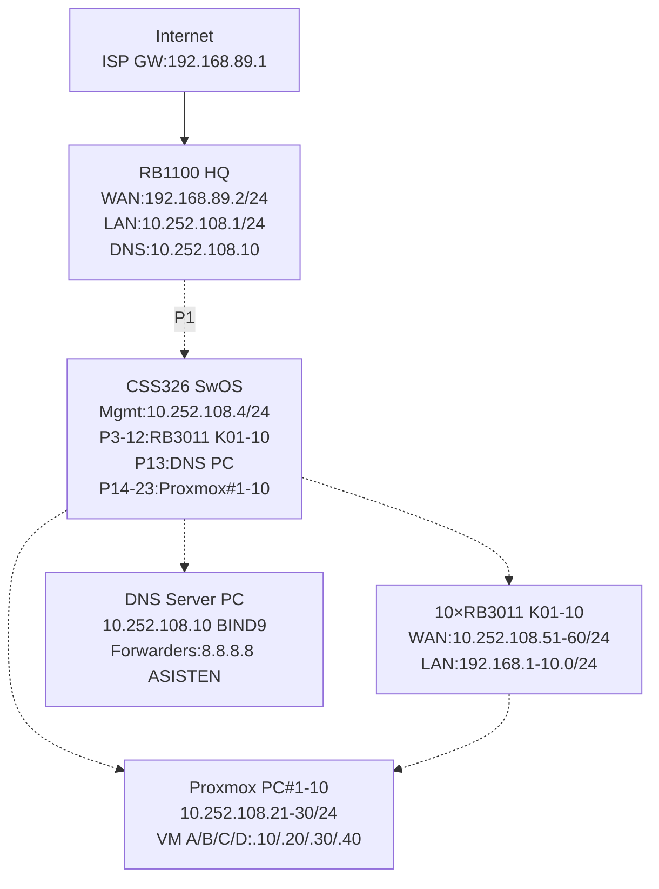

# MINGGU_1_SETUP_LAB

**Mata Kuliah:** Workshop Administrasi Sistem & Jaringan  
**Durasi:** 120 menit  
**Target:** 4 Kelas (A/B/C/D) × 10 Kelompok = 40 Kelompok Total  
**Hardware:** 1× RB1100, 1× CSS326 (.4), 10× RB3011, 10× Proxmox PC i7, 1× DNS PC
**Asisten:** Core infra (RB1100/CSS326/DNS); Kelompok: RB3011+Proxmox+VM

## Tujuan Pembelajaran

Setelah praktikum ini, mahasiswa mampu:  
1. Menjelaskan arsitektur jaringan lab 3-tier: HQ gateway → core switch → branch router → hypervisor → VM services [geeksforgeeks](https://www.geeksforgeeks.org/computer-networks/2-tier-and-3-tier-architecture-in-networking/)
2. Mengkonfigurasi MikroTik RB3011 sebagai branch router lengkap (WAN static, LAN/DHCP/NAT/DNS relay) [help.mikrotik](https://help.mikrotik.com/docs/spaces/ROS/pages/328151/First+Time+Configuration)
3. Menginstal Proxmox VE dengan IP statis dan deploy Ubuntu VM dengan konektivitas end-to-end [forum.proxmox](https://forum.proxmox.com/threads/proxmox-host-with-a-static-ip.167194/)
4. Memverifikasi alur paket VM → internet via DNS forwarder dedicated 10.252.108.10 [richinfante](https://www.richinfante.com/2020/02/21/bind9-on-my-lan)

## Dasar Teori

**Arsitektur 3-Tier Enterprise Network:** Core layer (RB1100 NAT gateway), distribution layer (CSS326 SwOS L2 switching/management), access layer (RB3011 branch routing + DHCP). Backbone 10.252.108.0/24 integrasikan semua elemen dengan single gateway 10.252.108.1 [cbtnuggets](https://www.cbtnuggets.com/blog/technology/networking/3-tier-network-structure-explained)

**RouterOS NAT Masquerade:** `/ip firewall nat chain=srcnat action=masquerade` transform source IP private → public via stateful connection tracking, enable multiple LAN host akses internet via single WAN IP [help.mikrotik](https://help.mikrotik.com/docs/spaces/ROS/pages/167706788/Default+configurations)

**Proxmox Linux Bridge:** `vmbr0` transparan L2 bridge antara physical NIC (eno1) dan VM VirtIO interfaces, konfigurasi static IP via `/etc/network/interfaces` [forum.proxmox](https://forum.proxmox.com/threads/proxmox-host-with-a-static-ip.167194/)

**BIND9 Forwarder:** DNS server internal forward unresolved query ke upstream (8.8.8.8) via `named.conf.options`, reduce external lookup latency untuk local network [gist.github](https://gist.github.com/gilangvperdana/88bb5676777d8c8557edb3d12fc17280)

## Topologi Jaringan



## Tabel Parameter Kelompok (K01-K10)

| Kelompok | RB3011 WAN IP | LAN Subnet/GW | Proxmox PC IP | VM Kelas A | VM Kelas B | VM Kelas C | VM Kelas D |
|----------|---------------|---------------|---------------|------------|------------|------------|------------|
| K01 | 10.252.108.51/24 | 192.168.1.0/24 GW1.1 | 10.252.108.21/24 | 192.168.1.10 | 192.168.1.20 | 192.168.1.30 | 192.168.1.40 |
| K02 | 10.252.108.52/24 | 192.168.2.0/24 GW2.1 | 10.252.108.22/24 | 192.168.2.10 | 192.168.2.20 | 192.168.2.30 | 192.168.2.40 |
| K03 | 10.252.108.53/24 | 192.168.3.0/24 GW3.1 | 10.252.108.23/24 | 192.168.3.10 | 192.168.3.20 | 192.168.3.30 | 192.168.3.40 |
| K04 | 10.252.108.54/24 | 192.168.4.0/24 GW4.1 | 10.252.108.24/24 | 192.168.4.10 | 192.168.4.20 | 192.168.4.30 | 192.168.4.40  |
| K05 | 10.252.108.55/24 | 192.168.5.0/24 GW5.1 | 10.252.108.25/24 | 192.168.5.10 | 192.168.5.20 | 192.168.5.30 | 192.168.5.40 |
| K06 | 10.252.108.56/24 | 192.168.6.0/24 GW6.1 | 10.252.108.26/24 | 192.168.6.10 | 192.168.6.20 | 192.168.6.30 | 192.168.6.40 |
| K07 | 10.252.108.57/24 | 192.168.7.0/24 GW7.1 | 10.252.108.27/24 | 192.168.7.10 | 192.168.7.20 | 192.168.7.30 | 192.168.7.40 |
| K08 | 10.252.108.58/24 | 192.168.8.0/24 GW8.1 | 10.252.108.28/24 | 192.168.8.10 | 192.168.8.20 | 192.168.8.30 | 192.168.8.40 |
| K09 | 10.252.108.59/24 | 192.168.9.0/24 GW9.1 | 10.252.108.29/24 | 192.168.9.10 | 192.168.9.20 | 192.168.9.30 | 192.168.9.40 |
| K10 | 10.252.108.60/24 | 192.168.10.0/24 GW10.1 | 10.252.108.30/24 | 192.168.10.10 | 192.168.10.20 | 192.168.10.30 | 192.168.10.40 |

**Catatan:** GW WAN=10.252.108.1 (RB1100 HQ), DNS relay=10.252.108.10 (semua DHCP)

## Pertanyaan Teori (Pre-Lab)

1. **Apa perbedaan fungsi core switch CSS326 SwOS vs access router RB3011 dalam arsitektur 3-tier?** Jelaskan peran VLAN filtering mencegah broadcast storm [wiki.mikrotik](https://wiki.mikrotik.com/SWOS/CSS326-VLAN-Example)
2. **Bagaimana mekanisme RouterOS NAT masquerade** memungkinkan multiple LAN host akses internet via single WAN IP? Apa implikasi stateful tracking? [help.mikrotik](https://help.mikrotik.com/docs/spaces/ROS/pages/328151/First+Time+Configuration)
3. **Jelaskan Linux bridge vmbr0 pada Proxmox** dan konfigurasi Netplan YAML untuk IP statis VM Ubuntu [forum.proxmox](https://forum.proxmox.com/threads/proxmox-host-with-a-static-ip.167194/)
4. **Apa fungsi BIND9 forwarders** dan mengapa diperlukan `allow-query { any; }` pada DNS server internal? [richinfante](https://www.richinfante.com/2020/02/21/bind9-on-my-lan)

## Langkah-langkah Praktikum

### 1. Core Infrastructure (Asisten, 10 menit)

**RB1100 HQ Gateway:**
```mikrotik
/interface ethernet set [find default-name=ether1] name=WAN
/interface ethernet set [find default-name=ether2] name=LAN
/ip address add address=10.252.108.1/24 interface=LAN
/ip dns set servers=10.252.108.10 allow-remote-requests=yes
/ip firewall nat add chain=srcnat action=masquerade out-interface=WAN
/ip route add dst-address=0.0.0.0/0 gateway=192.168.89.1
```

**CSS326 SwOS** (http://10.252.108.4): Hosts add 10.252.108.4 gw 10.252.108.1; Ports P1-P23 Forward Basic

**DNS Server 10.252.108.10:**
```bash
sudo apt update && sudo apt install bind9 -y
sudo nano /etc/bind/named.conf.options
```
```
options {
    forwarders { 8.8.8.8; 8.8.4.4; };
    allow-query { any; };
    listen-on { 10.252.108.10; };
};
```
```bash
sudo systemctl restart bind9 && sudo systemctl enable bind9
sudo dig @10.252.108.10 google.com
```

### 2. RB3011 Branch Router (Kelompok, 20 menit)
Ganti `[X]` sesuai kelompok (K01=1, K02=2, dst.), `[WAN_IP]` dari tabel:

```mikrotik
/interface ethernet set [find default-name=ether1] name=WAN
/interface ethernet set [find default-name=ether2] name=LAN
/ip address add address=[WAN_IP]/24 interface=WAN
/ip address add address=192.168.[X].1/24 interface=LAN
/ip route add dst-address=0.0.0.0/0 gateway=10.252.108.1
/ip pool add name=dhcp_pool ranges=192.168.[X].10-192.168.[X].100
/ip dhcp-server add name=dhcp1 interface=LAN address-pool=dhcp_pool
/ip dhcp-server network add address=192.168.[X].0/24 gateway=192.168.[X].1 dns-server=10.252.108.10
/ip dhcp-server set dhcp1 disabled=no
/ip firewall nat add chain=srcnat action=masquerade out-interface=WAN
/export file=rb-k[X].rsc
```

### 3. Proxmox VE Setup (Kelompok, 20 menit)
```bash
sudo nano /etc/network/interfaces
```
```
auto vmbr0
iface vmbr0 inet static
    address 10.252.108.[2Y]/24  # Y=1-10 → .21-.30
    gateway 10.252.108.1
    bridge-ports eno1
    bridge-stp off
    bridge-fd 0
    dns-nameservers 10.252.108.10
```
```bash
ifreload -a && reboot
# GUI: https://10.252.108.[2Y]:8006
```

### 4. Ubuntu VM Deploy (Kelompok, 30 menit)
Proxmox GUI: Create VM → Ubuntu ISO → Network VirtIO vmbr0

**VM Console:**
```bash
sudo apt update && sudo apt install openssh-server net-tools -y
sudo nano /etc/netplan/00-installer-config.yaml
```
```yaml
network:
  version: 2
  ethernets:
    enp1s0:
      dhcp4: no
      addresses: [192.168.[X].[YY]/24]  # YY=10(A)/20(B)/30(C)/40(D)
      gateway4: 192.168.[X].1
      nameservers:
        addresses: [10.252.108.10]
```
```bash
sudo netplan apply && sudo reboot
```

### 5. Verifikasi End-to-End (20 menit)
**Dari VM SSH:**
```bash
ip addr show enp1s0
ping 192.168.[X].1    # LAN GW
ping 10.252.108.1     # HQ Backbone
ping 8.8.8.8          # Internet
nslookup google.com 10.252.108.10  # DNS Forward
```

**Screenshot wajib:** RB leases, Proxmox GUI, VM ping chain, nslookup

## Final Checklist

| No | Item Checklist | Status | Screenshot |
|----|----------------|--------|------------|
| 1 | RB3011: DHCP leases + `/export rb-k[X].rsc` | [ ] | rb-lease.png |
| 2 | CSS326: `ping 10.252.108.4` sukses | [ ] | css-ping.png |
| 3 | Proxmox GUI: VM running | [ ] | prox-gui.png |
| 4 | VM: `ip addr` correct static IP | [ ] | vm-ip.png |
| 5 | VM: 4x ping + `nslookup google.com` | [ ] | vm-test.png |

## Tabel Troubleshooting

| Masalah | Penyebab | Solusi Cepat |
|---------|----------|--------------|
| No DHCP VM | RB network dns-server salah | `/ip dhcp-server network edit dns-server=10.252.108.10` [help.mikrotik](https://help.mikrotik.com/docs/spaces/ROS/pages/328151/First+Time+Configuration) |
| Proxmox no network | `interfaces` gw/dns salah | `dns-nameservers 10.252.108.10; ifreload -a` [forum.proxmox](https://forum.proxmox.com/threads/proxmox-host-with-a-static-ip.167194/) |
| CSS326 .4 unreachable | Hosts/gw salah | SwOS Hosts: 10.252.108.4 gw 10.252.108.1 [wiki.mikrotik](https://wiki.mikrotik.com/SWOS/CSS326-VLAN-Example) |
| DNS resolve gagal | BIND9 forwarders down | Asisten: `named.conf.options forwarders 8.8.8.8; systemctl restart bind9` [richinfante](https://www.richinfante.com/2020/02/21/bind9-on-my-lan) |
| No internet VM | NAT/route hilang | RB3011: `/ip route add gw=10.252.108.1; nat masquerade` [docs.sim-cloud](https://docs.sim-cloud.net/en/solutions-virtual-router/mikrotik/basic-setting.html) | [perplexity](https://www.perplexity.ai/search/6fb88c36-2abb-459e-9ce2-55b48429c26c)

## Pertanyaan Post-Lab (Laporan)

1. **Alur Paket VM → Internet:** Jelaskan step-by-step dari `ping google.com` di VM 192.168.1.10: DHCP lease → RB3011 NAT → RB1100 NAT → BIND9 forward → ISP (diagram wajib) [help.mikrotik](https://help.mikrotik.com/docs/spaces/ROS/pages/167706788/Default+configurations)
2. **Keunggulan 3-Tier vs Flat Network:** Skalabilitas 40 kelompok lab dan peran VLAN1 untagged untuk simplicity Minggu 1 [geeksforgeeks](https://www.geeksforgeeks.org/computer-networks/2-tier-and-3-tier-architecture-in-networking/)
3. **Single Point of Failure:** Identifikasi risiko CSS326; usulkan mitigasi redundant link atau SwOS ACL [wiki.mikrotik](https://wiki.mikrotik.com/SWOS/CSS326-VLAN-Example)

## Laporan Akhir

**Submit PDF:** 5 screenshot checklist + jawaban 3 pertanyaan + file `rb-k[X].rsc`  
**Status:** Backbone production-ready untuk Minggu 2 (Linux services di VM srv-kXX) 🎉

**Distribusi:** Print 10 eksemplar/sesi (4 kelas bergilir Senin-Kamis). Asisten verifikasi core (.1/.4/.10) sebelum lab dimulai. 

***

