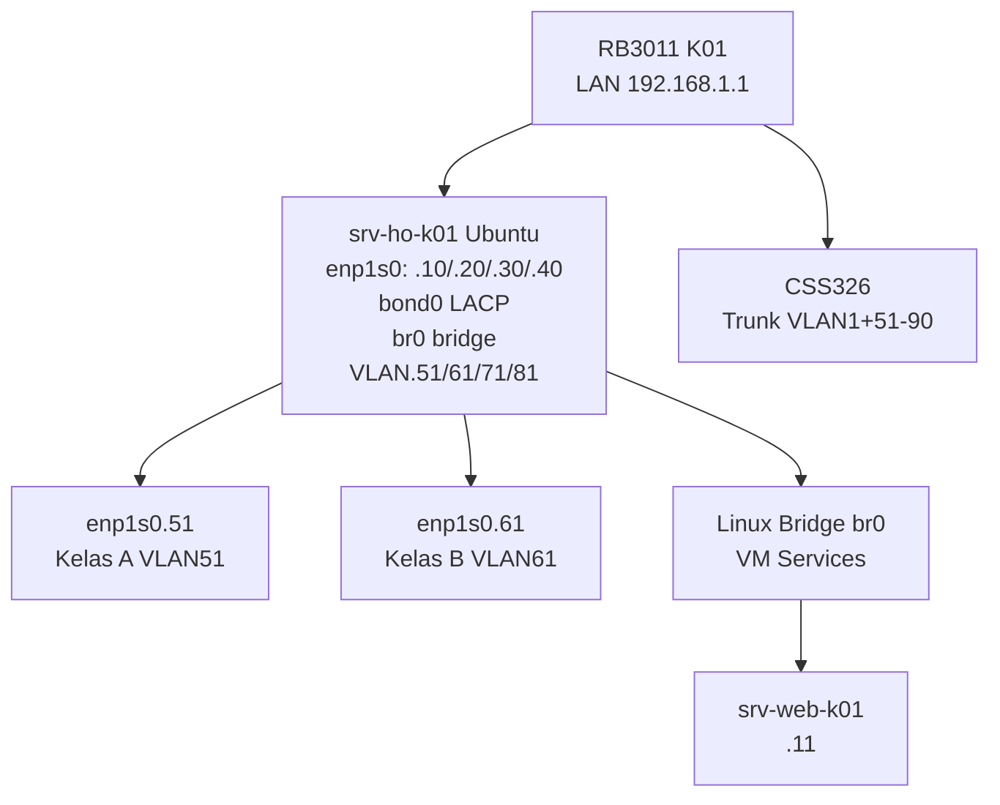

# MINGGU_2_Multi-IP_Policy_based_routing

**Mata Kuliah:** Workshop Administrasi Sistem & Jaringan  
**Topik:** Linux Network Administration (Multi-IP, Policy Routing, Bonding, Bridge, VLAN)  
**Durasi:** 120 menit  
**Target:** 4 Kelas × 10 Kelompok (VM Ubuntu dari Minggu 1 ready)  
**Prasyarat:** VM `srv-kelas[A/B/C/D]-k[X]` running dengan IP statis 192.168.[X].[YY]

## Tujuan Pembelajaran

Setelah praktikum ini, mahasiswa mampu:

1. Mengkonfigurasi multiple IP addresses (aliases) pada single interface Linux server menggunakan Netplan YAML
2. Mengimplementasikan policy-based routing (PBR) dengan custom routing tables dan ip rules untuk multi-tenant traffic
3. Membangun network bonding LACP (802.3ad) dan Linux bridge untuk high-availability dan virtual switching
4. Mengkonfigurasi VLAN subinterfaces (802.1q) pada Linux untuk traffic isolation per kelas
5. Menganalisis advanced networking configuration dan persistensi konfigurasi via Netplan

## Dasar Teori

### Linux Multi-IP Aliasing

Linux mendukung multiple IP addresses pada single interface melalui IP aliasing atau CIDR notation dalam Netplan. Konfigurasi ini memungkinkan satu server fisik menangani services untuk multiple logical networks (multi-tenancy).

**Netplan YAML Example:**
```yaml
ethernets:
  enp1s0:
    addresses:
      - 192.168.1.10/24  # Kelas A
      - 192.168.1.20/24  # Kelas B
```

### Policy-Based Routing (PBR)

Linux kernel mendukung multiple routing tables (table 100-252 custom). Policy routing memilih routing table berdasarkan source IP, protocol, atau packet mark melalui `ip rule`.

**Alur PBR:**
```
Packet Arrival → ip rule lookup → Selected Table → FIB lookup → Forward
```

### Network Bonding & Linux Bridge

**Bonding Mode 4 (802.3ad/LACP):** Agregasi link dengan dynamic negotiation via LACP protocol untuk link aggregation dan failover.

**Linux Bridge:** Virtual Layer 2 switch menghubungkan multiple interfaces dan VM transparan.

### VLAN Tagging (802.1q)

Linux VLAN subinterfaces (`enp1s0.51`) menerima tagged frames VLAN ID 51, memungkinkan traffic isolation tanpa hardware VLAN support.

## Topologi Jaringan Minggu 2



## Tabel Policy Routing Per Kelompok (Valid IP Scheme)

| Kelompok | VM Base | Table 100 Kelas A | Table 200 Kelas B | Table 300 Kelas C | Table 400 Kelas D |
|----------|---------|-------------------|-------------------|-------------------|-------------------|
| K01 | 192.168.1.* | 10.252.10.10.0/24 | 10.252.10.20.0/24 | 10.252.10.30.0/24 | 10.252.10.40.0/24 |
| K02 | 192.168.2.* | 10.252.20.10.0/24 | 10.252.20.20.0/24 | 10.252.20.30.0/24 | 10.252.20.40.0/24 |
| K03 | 192.168.3.* | 10.252.30.10.0/24 | 10.252.30.20.0/24 | 10.252.30.30.0/24 | 10.252.30.40.0/24 |
| K04 | 192.168.4.* | 10.252.40.10.0/24 | 10.252.40.20.0/24 | 10.252.40.30.0/24 | 10.252.40.40.0/24 |
| K05 | 192.168.5.* | 10.252.50.10.0/24 | 10.252.50.20.0/24 | 10.252.50.30.0/24 | 10.252.50.40.0/24 |
| K06 | 192.168.6.* | 10.252.60.10.0/24 | 10.252.60.20.0/24 | 10.252.60.30.0/24 | 10.252.60.40.0/24 |
| K07 | 192.168.7.* | 10.252.70.10.0/24 | 10.252.70.20.0/24 | 10.252.70.30.0/24 | 10.252.70.40.0/24 |
| K08 | 192.168.8.* | 10.252.80.10.0/24 | 10.252.80.20.0/24 | 10.252.80.30.0/24 | 10.252.80.40.0/24 |
| K09 | 192.168.9.* | 10.252.90.10.0/24 | 10.252.90.20.0/24 | 10.252.90.30.0/24 | 10.252.90.40.0/24 |
| K10 | 192.168.10.* | 10.252.100.10.0/24 | 10.252.100.20.0/24 | 10.252.100.30.0/24 | 10.252.100.40.0/24 |

## Pertanyaan Teori (Pre-Lab)

1. **Policy Routing:** Jelaskan perbedaan `ip route` (table main) vs custom table 100 dengan `ip rule from 192.168.1.10 table 100`
2. **Bonding:** Apa perbedaan mode 4 (802.3ad/LACP) vs mode 0 (balance-rr) dan kapan menggunakan masing-masing?
3. **Linux Bridge:** Bagaimana `bridge-ports eno1` dan `bridge vlan` bekerja untuk VM passthrough?
4. **VLAN:** Jelaskan `ip link add link=enp1s0 name=enp1s0.51 type vlan id=51` untuk isolasi traffic

## Langkah-langkah Praktikum

### 1. Backup & Multi-IP Aliases (15 menit)
**SSH ke VM srv-ho-kXX** dari Minggu 1:
```bash
sudo cp -r /etc/netplan /etc/netplan.backup
sudo nano /etc/netplan/01-multiip.yaml
```

```yaml
network:
  version: 2
  ethernets:
    enp1s0:
      dhcp4: no
      addresses:
        - 192.168.[X].10/24  # Kelas A
        - 192.168.[X].20/24  # Kelas B  
        - 192.168.[X].30/24  # Kelas C
        - 192.168.[X].40/24  # Kelas D
      gateway4: 192.168.[X].1
      nameservers:
        addresses: [10.252.108.10]
```

```bash
sudo netplan apply
ip addr show enp1s0  # Verify 4 IP
ping -I 192.168.[X].10 10.252.108.1
```

### 2. Policy-Based Routing (20 menit)
**Ganti [X] sesuai kelompok Anda:**
```bash
# Table 100: Kelas A (.10)
sudo ip route add 10.252.[X]0.10.0/24 via 192.168.[X].1 table 100
sudo ip rule add from 192.168.[X].10 table 100 prio 1000

# Table 200: Kelas B (.20)  
sudo ip route add 10.252.[X]0.20.0/24 via 192.168.[X].1 table 200
sudo ip rule add from 192.168.[X].20 table 200 prio 2000

# Table 300: Kelas C (.30)
sudo ip route add 10.252.[X]0.30.0/24 via 192.168.[X].1 table 300
sudo ip rule add from 192.168.[X].30 table 300 prio 3000

# Table 400: Kelas D (.40)
sudo ip route add 10.252.[X]0.40.0/24 via 192.168.[X].1 table 400
sudo ip rule add from 192.168.[X].40 table 400 prio 4000

sudo ip route flush cache
```

**Verify:**
```bash
ip route show table 100
ip rule show
ip route get 10.252.[X]0.10.1 from 192.168.[X].10
```

### 3. Network Bonding LACP (20 menit)
```bash
# Load bonding module
sudo modprobe bonding

# Create bond0 LACP (mode 4)
sudo ip link add bond0 type bond mode 4 lacp_rate 1 xmit_hash_policy layer3+4
sudo ip link set enp1s0 master bond0
sudo ip link set bond0 up
sudo ip addr add 192.168.[X].5/24 dev bond0

# Status bonding
cat /proc/net/bonding/bond0
```

### 4. Linux Bridge + VLAN (25 menit)
```bash
# Bridge br0
sudo ip link add br0 type bridge
sudo ip link set enp1s0 master br0
sudo ip addr add 192.168.[X].1/24 dev br0
sudo ip link set br0 up

# VLAN Kelas A (ID 51)
sudo ip link add link=enp1s0 name=enp1s0.51 type vlan id=51
sudo ip addr add 192.168.[X].51/24 dev enp1s0.51
sudo ip link set enp1s0.51 up

# Persist via Netplan
sudo nano /etc/netplan/02-advanced.yaml
sudo netplan apply
```

### 5. Verifikasi Final (20 menit)
```bash
ip addr show      # Multi-IP + VLAN + bond0 + br0
ip route show table all
cat /proc/net/bonding/bond0
bridge vlan show
ping -I enp1s0.51 10.252.108.1  # VLAN test
```

## Final Checklist

| No | Item | Status | Screenshot |
|----|------|--------|------------|
| 1 | 4 IP aliases enp1s0 (.10/.20/.30/.40) | [ ] | multi-ip.png |
| 2 | Policy tables 100-400 + rules | [ ] | ip-route.png |
| 3 | bond0 LACP mode 4 active | [ ] | bonding.png |
| 4 | br0 bridge + VLAN.51 UP | [ ] | bridge-vlan.png |
| 5 | Ping per IP/VLAN backbone | [ ] | ping-test.png |
| 6 | Netplan configs persistent | [ ] | netplan.png |
| 7 | `/proc/net/bonding/bond0` status | [ ] | bonding-status.png |

## Tabel Troubleshooting

| Masalah | Penyebab | Solusi |
|---------|----------|--------|
| `netplan apply` error | YAML indent salah | `netplan --debug generate` |
| No policy routing | Rule priority conflict | `ip rule show`; delete duplicate |
| Bonding no slaves | Module unloaded | `modprobe bonding` |
| VLAN down | Parent interface down | `ip link set enp1s0 up` |
| Bridge no forward | STP blocking | `echo 0 > /sys/class/net/br0/bridge/stp_state` |

## Pertanyaan Post-Lab

1. **Analisis PBR:** Trace `ping -I 192.168.1.10 10.252.10.10.1` menggunakan `ip route get`
2. **Bonding Trade-offs:** LACP vs balance-rr untuk VM high-throughput lab
3. **Netplan Persistence:** Bagaimana `/etc/netplan/` override `ip` commands setelah reboot?

## Laporan Format

**PDF:** 7 screenshots + netplan YAML files + 3 jawaban analisis + `ip route show table all`

**Status:** Ready Minggu 3 BIND9 zones! 🎉

