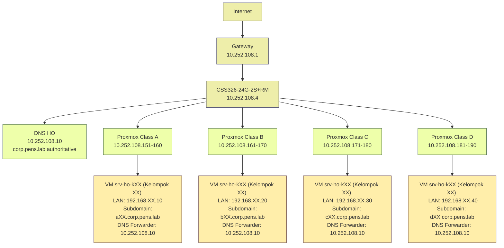

## MINGGU 3: DNS Delegated Subdomain dengan BIND9

**Mata Kuliah:** Workshop Administrasi Sistem & Jaringan  
**Topik:** DNS Hierarchical Delegation - BIND9 Subdomain [kelas][kelompok].corp.pens.lab  
**Durasi:** 120 menit  
**Target:** 40 VM (4 Kelas × 10 Kelompok paralel)  
**Prasyarat:** VM Ubuntu dari MINGGU_2 dengan multi-IP LAN

---

## 1. TUJUAN PEMBELAJARAN

Setelah praktikum ini, mahasiswa mampu:

1. Menginstal dan mengkonfigurasi BIND9 sebagai authoritative DNS server untuk subdomain delegated
2. Memahami mekanisme delegation NS dengan glue records di parent zone (DNS HO)
3. Konfigurasi forwarders untuk resolusi parent domain dan external queries
4. Setup ACL (Access Control List) untuk security DNS internal lab
5. Verifikasi resolusi DNS hierarchical end-to-end: local → delegated → forwarded
6. Troubleshoot common DNS issues (NXDOMAIN, SERVFAIL, REFUSED)

---

## 2. DASAR TEORI

### 2.1 DNS Hierarchical Delegation

DNS menggunakan struktur tree hierarchy dari root (.) → TLD (.com, .lab) → domain (corp.pens.lab) → subdomain (a01.corp.pens.lab). Delegation memungkinkan parent zone mendelegasikan authority subdomain ke NS child server.

**Komponen Delegation:**
- **Parent Zone (HO):** DNS 10.252.108.10 authoritative untuk corp.pens.lab
- **NS Record:** Pointer ke nameserver child (contoh: `a01.corp.pens.lab. IN NS ns1.a01.corp.pens.lab.`)
- **Glue Record:** A record untuk NS child di parent zone (contoh: `ns1.a01.corp.pens.lab. IN A 192.168.1.10`)
- **Child Zone (VM Kelompok):** BIND9 authoritative untuk subdomain a01.corp.pens.lab

Glue record **esensial** untuk hindari circular dependency: client query a01.corp.pens.lab → HO reply NS ns1.a01.corp.pens.lab + glue A 192.168.1.10 → client langsung query 192.168.1.10.

### 2.2 BIND9 Architecture

**File Struktur:**
- `/etc/bind/named.conf` - Main config (include options & local)
- `/etc/bind/named.conf.options` - Global options (forwarders, ACL, recursion)
- `/etc/bind/named.conf.local` - Zone definitions (master/slave)
- `/etc/bind/db.[zone]` - Zone file (SOA, NS, A, MX, PTR records)

**Record Types:**
- **SOA (Start of Authority):** Authority metadata (serial, refresh, retry, expire, TTL)
- **NS (Name Server):** Delegation pointer ke nameserver
- **A (Address):** IPv4 mapping hostname → IP
- **MX (Mail Exchanger):** Mail routing dengan priority
- **CNAME (Canonical Name):** Alias hostname
- **PTR (Pointer):** Reverse IP → hostname

### 2.3 Forwarders & Recursion

**Forwarders** kirim non-authoritative queries ke upstream DNS (HO 10.252.108.10) untuk resolve parent corp.pens.lab dan external (google.com). `forward-only` cegah VM langsung query internet (security lab).

**ACL (Access Control List)** batasi `allow-query` ke subnet lab (192.168.0.0/16) hindari DNS abuse dari luar.

---

## 3. TOPOLOGI LAB

**Skema IP:**
- Backbone: 10.252.108.0/24
- VM LAN: 192.168.1-10.[10/20/30/40] (40 kelompok)
- DNS HO: 10.252.108.10 (parent authority)
- VM DNS: 192.168.[kelompok].[offset] (child authority)

**Lihat file terpisah `TABEL_KELOMPOK_DNS.md` untuk mapping lengkap 40 subdomain.**

---

## 4. LANGKAH PRAKTIKUM

### Step 1: Persiapan VM dan Instalasi BIND9

Login ke VM srv-ho-kXX (sesuai kelompok di tabel), pastikan koneksi internet aktif:

```bash
# Update repository
sudo apt update && sudo apt upgrade -y

# Install BIND9, utilities, dan tools
sudo apt install bind9 bind9utils bind9-doc dnsutils nano net-tools -y

# Cek status BIND9 (inactive/dead OK, belum konfigurasi)
sudo systemctl status bind9

# Cek versi BIND9
named -v
```

**Expected output:** BIND 9.16+ installed, service inactive.

---

### Step 2: Konfigurasi named.conf.options (Forwarders & ACL)

Edit file options untuk setup forwarders ke HO dan ACL security:

```bash
sudo nano /etc/bind/named.conf.options
```

**Hapus semua isi lama**, ganti dengan konfigurasi ini (copy-paste):

```
options {
    directory "/var/cache/bind";
    
    // Recursion untuk client internal
    recursion yes;
    allow-recursion { localnets; };
    
    // Forwarders ke DNS HO untuk parent & external
    forwarders {
        10.252.108.10;
    };
    forward only;
    
    // ACL batasi query ke lab networks
    allow-query { 192.168.0.0/16; localnets; };
    
    // Listen semua interface
    listen-on { any; };
    listen-on-v6 { any; };
    
    // DNSSEC validation auto
    dnssec-validation auto;
    
    auth-nxdomain no;    # conform to RFC1035
};
```

**Simpan:** Ctrl+O, Enter, Ctrl+X.

**Verifikasi syntax:**
```bash
sudo named-checkconf
```
**No output = OK. Jika error, cek tanda baca { } ;**

---

### Step 3: Tambah Zone di named.conf.local

Deklarasi zone subdomain kelompok Anda:

```bash
sudo nano /etc/bind/named.conf.local
```

**Tambahkan di akhir file** (ganti **[SUBDOMAIN]** dengan subdomain Anda dari tabel, lowercase):

```
zone "[SUBDOMAIN]" {
    type master;
    file "/etc/bind/db.[SUBDOMAIN]";
    allow-transfer { none; };
};
```

**Contoh untuk Kelas A Kelompok 01:**
```
zone "a01.corp.pens.lab" {
    type master;
    file "/etc/bind/db.a01.corp.pens.lab";
    allow-transfer { none; };
};
```

**Simpan:** Ctrl+O, Enter, Ctrl+X.

**Verifikasi:**
```bash
sudo named-checkconf
```

---

### Step 4: Buat Zone File db.[SUBDOMAIN]

Copy template dan edit zone file:

```bash
# Copy template
sudo cp /etc/bind/db.local /etc/bind/db.[SUBDOMAIN]

# Edit zone file (ganti [SUBDOMAIN] dengan subdomain Anda)
sudo nano /etc/bind/db.[SUBDOMAIN]
```

**Hapus isi lama, copy-paste template ini** (ganti bagian **[SUBDOMAIN]**, **[VM_IP]**, **[VM_IP+1]**, dll):

```
$TTL    86400
@       IN      SOA     ns1.[SUBDOMAIN]. admin.[SUBDOMAIN]. (
                        2026022101      ; Serial (YYYYMMDDNN)
                        3600            ; Refresh (1 hour)
                        1800            ; Retry (30 minutes)
                        604800          ; Expire (1 week)
                        86400 )         ; Minimum TTL (1 day)

; Name Server
@       IN      NS      ns1.[SUBDOMAIN].

; A Records
ns1     IN      A       [VM_IP]
www     IN      A       [VM_IP+1]
ftp     IN      A       [VM_IP+2]
mail    IN      A       [VM_IP+3]

; MX Record
@       IN      MX 10   mail.[SUBDOMAIN].

; Wildcard
*       IN      A       [VM_IP]
```

**Contoh untuk Kelas A Kelompok 01** (subdomain: a01.corp.pens.lab, VM IP: 192.168.1.10):

```
$TTL    86400
@       IN      SOA     ns1.a01.corp.pens.lab. admin.a01.corp.pens.lab. (
                        2026022101
                        3600
                        1800
                        604800
                        86400 )

@       IN      NS      ns1.a01.corp.pens.lab.

ns1     IN      A       192.168.1.10
www     IN      A       192.168.1.11
ftp     IN      A       192.168.1.12
mail    IN      A       192.168.1.13

@       IN      MX 10   mail.a01.corp.pens.lab.

*       IN      A       192.168.1.10
```

**Simpan:** Ctrl+O, Enter, Ctrl+X.

**Catatan Serial Number:**
- Format: YYYYMMDDNN (2026022101 = 21 Feb 2026 revision 01)
- **WAJIB increment** setiap edit zone file (02, 03, dst)
- Slave DNS pakai serial untuk sync zone transfer

---

### Step 5: Set Permission dan Validasi Zone

Set ownership ke user `bind` dan validasi syntax zone:

```bash
# Set ownership
sudo chown bind:bind /etc/bind/db.[SUBDOMAIN]
sudo chmod 644 /etc/bind/db.[SUBDOMAIN]

# Validasi zone syntax (ganti [SUBDOMAIN])
sudo named-checkzone [SUBDOMAIN] /etc/bind/db.[SUBDOMAIN]
```

**Expected output:**
```
zone a01.corp.pens.lab/IN: loaded serial 2026022101
OK
```

**Jika error:**
- `syntax error` → cek tanda baca, spasi, tab
- `no TTL` → pastikan ada $TTL di baris 1
- `not at top of zone` → cek @ dan NS record

---

### Step 6: Konfigurasi Firewall UFW

Buka port DNS 53 (UDP & TCP):

```bash
# Enable UFW jika belum aktif
sudo ufw enable

# Allow DNS port 53
sudo ufw allow 53/tcp
sudo ufw allow 53/udp

# Reload firewall
sudo ufw reload

# Cek status
sudo ufw status numbered
```

**Expected:** Port 53 ALLOW dari anywhere.

---

### Step 7: Restart BIND9 Service

Enable dan restart BIND9:

```bash
# Restart service
sudo systemctl restart bind9

# Enable auto-start boot
sudo systemctl enable bind9

# Cek status (WAJIB running)
sudo systemctl status bind9
```

**Expected output:**
```
● named.service - BIND Domain Name Server
   Loaded: loaded
   Active: active (running)
```

**Jika failed:**
```bash
# Cek error log
sudo journalctl -xeu bind9
```

---

### Step 8: Testing Local Resolution

Test query lokal dari VM sendiri:

```bash
# Test 1: Query SOA record
dig @localhost [SUBDOMAIN] SOA

# Test 2: Query NS record
dig @localhost [SUBDOMAIN] NS

# Test 3: Query www subdomain
dig @localhost www.[SUBDOMAIN]

# Test 4: Query MX record
dig @localhost [SUBDOMAIN] MX

# Test 5: Query wildcard
dig @localhost random.subdomain.[SUBDOMAIN]
```

**Expected di ANSWER SECTION:**
- SOA: serial 2026022101, ns1.[SUBDOMAIN]
- NS: ns1.[SUBDOMAIN]
- A: www → [VM_IP+1]
- MX: priority 10, mail.[SUBDOMAIN]
- Flags: **aa** (AUTHORITATIVE ANSWER)
- Status: **NOERROR**

**Screenshot Test 1 untuk laporan.**

---

### Step 9: Testing Delegation dari HO

Test delegation dari DNS HO (10.252.108.10):

```bash
# Dari VM Anda, query ke HO
dig @10.252.108.10 [SUBDOMAIN] NS
dig @10.252.108.10 www.[SUBDOMAIN]
```

**Expected:**
- HO reply NS: ns1.[SUBDOMAIN]
- HO reply ADDITIONAL SECTION: ns1.[SUBDOMAIN] A [VM_IP] (glue record)
- www.[SUBDOMAIN] resolve ke [VM_IP+1]

**Jika NXDOMAIN:** Asisten belum tambah NS + glue di HO zone /etc/bind/db.corp.pens.lab. Konfirmasi ke asisten lab.

**Screenshot Test 2 untuk laporan.**

---

### Step 10: Testing Forward Resolution

Test forward queries ke parent dan external:

```bash
# Test forward ke parent corp.pens.lab
dig @localhost corp.pens.lab SOA

# Test forward ke external
dig @localhost google.com
dig @localhost detik.com

# Cek DNS server yang reply
dig @localhost www.google.com +trace
```

**Expected:**
- corp.pens.lab resolve via HO (forward ke 10.252.108.10)
- google.com resolve via HO → internet
- Flags: **rd ra** (recursion desired/available), **bukan aa**

**Screenshot Test 3 untuk laporan.**

---

### Step 11: Testing dari Client Lain

Dari VM kelompok lain atau Proxmox host, test cross-kelompok:

```bash
# Set DNS temporary (dari VM kelompok lain)
echo "nameserver [VM_IP_ANDA]" | sudo tee /etc/resolv.conf

# Test query cross-kelompok
dig www.[SUBDOMAIN_ANDA]
nslookup mail.[SUBDOMAIN_ANDA]
```

**Expected:** Resolve sukses, reply dari [VM_IP_ANDA].

**Screenshot Test 4 untuk laporan.**

---

## 5. PERTANYAAN PRE-LAB (Teori)

Jawab sebelum praktikum (tulis di laporan):

1. Jelaskan fungsi SOA serial number dan kapan harus di-increment?
2. Bagaimana mekanisme delegation NS + glue record bekerja untuk subdomain?
3. Apa perbedaan `recursion yes` dengan `forward only` di BIND9?
4. Mengapa ACL `allow-query` penting untuk security DNS internal lab?
5. Jelaskan alur resolusi hierarchical: client query www.a01.corp.pens.lab dari nol sampai dapat IP!

---

## 6. PERTANYAAN POST-LAB (Analisis)

Jawab setelah praktikum (tulis di laporan):

1. Apa yang terjadi jika glue record tidak ada di HO zone corp.pens.lab?
2. Bagaimana cara troubleshoot jika `dig @localhost` NOERROR tapi `dig @10.252.108.10` NXDOMAIN?
3. Apa keuntungan model distributed DNS per-kelompok dibanding single DNS untuk seluruh lab?
4. Bagaimana integrasi DNS delegated ini bisa dipakai untuk SOAR/NIDS monitoring nanti (Minggu 8-10)?
5. Jika ingin tambah slave DNS untuk redundancy, konfigurasi apa saja yang perlu diubah?

---

## 7. FINAL CHECKLIST

Centang sebelum submit laporan:

- [ ] BIND9 running: `systemctl status bind9` active (running)
- [ ] Syntax valid: `named-checkconf` no error
- [ ] Zone valid: `named-checkzone [SUBDOMAIN]` OK
- [ ] Local query NOERROR: `dig @localhost www.[SUBDOMAIN]`
- [ ] Authority flag `aa` muncul di local query
- [ ] Delegation OK: `dig @10.252.108.10 [SUBDOMAIN] NS` reply ns1.[SUBDOMAIN]
- [ ] Glue record: HO reply ADDITIONAL SECTION dengan A record ns1
- [ ] Forward OK: `dig @localhost google.com` resolve via HO
- [ ] Cross-kelompok: VM lain bisa query [SUBDOMAIN] Anda
- [ ] UFW port 53 allowed: `ufw status` show 53/tcp 53/udp
- [ ] 6 screenshot dig tersimpan (local, delegation, forward, cross-kelompok, external, trace)

---

## 8. TABEL TROUBLESHOOTING

| **Gejala**                          | **Kemungkinan Cause**              | **Fix**                                                     |
|-------------------------------------|-------------------------------------|-------------------------------------------------------------|
| `named-checkconf` syntax error     | Kurung kurawal { } tidak match     | Nano /etc/bind/named.conf.options, cek setiap { harus ada } |
| `named-checkzone` syntax error     | SOA/TTL format salah               | Cek spasi, tab, tanda kurung SOA, serial numeric            |
| `systemctl status bind9` failed    | Config/zone syntax error           | `journalctl -xeu bind9`, perbaiki file yang error           |
| `dig @localhost` connection refused | BIND9 not running atau crash       | `systemctl restart bind9`, cek log journalctl               |
| `dig @localhost` NXDOMAIN          | Zone belum loaded                  | Cek named.conf.local ada zone, restart bind9               |
| `dig @localhost` SERVFAIL          | Forwarders unreachable             | Ping 10.252.108.10, cek named.conf.options forwarders       |
| `dig @10.252.108.10` NXDOMAIN      | Delegation belum di-setup HO       | Konfirmasi asisten: HO db.corp.pens.lab harus ada NS + glue|
| `dig @VM_IP` refused               | UFW block port 53 atau ACL salah   | `ufw allow 53`, cek allow-query include 192.168.0.0/16     |
| Query dari VM lain timeout         | Firewall atau routing issue        | Ping VM_IP, traceroute, cek iptables/ufw                    |
| Forward google.com SERVFAIL        | HO forwarders mati atau loop       | Dari VM: `dig @10.252.108.10 google.com`, konfirmasi HO OK  |
| Authority flag `aa` tidak muncul   | Query tidak ke authoritative zone  | Pastikan query [SUBDOMAIN] Anda, bukan parent corp.pens.lab|
| Serial increment tidak propagate   | Lupa restart bind9                 | Edit zone serial++, `rndc reload`, cek dig SOA serial       |
| Permission denied zone file        | File ownership bukan bind          | `chown bind:bind /etc/bind/db.*`, `chmod 644`               |

---

## 9. FORMAT LAPORAN

Submit via ethol dalam **satu file PDF (max 5 halaman)**:

**Halaman 1: Cover & Data Kelompok**
- Judul: Laporan Praktikum MINGGU 3 - DNS Delegated Subdomain BIND9
- Nama/NRP anggota kelompok
- Kelas, Kelompok, Subdomain (dari tabel terpisah)
- Tanggal praktikum

**Halaman 2-3: Screenshot Testing (6 gambar wajib)**
1. `dig @localhost www.[SUBDOMAIN]` - local query NOERROR + aa
2. `dig @10.252.108.10 [SUBDOMAIN] NS` - delegation + glue
3. `dig @localhost google.com` - forward resolution
4. `dig @[VM_IP]` dari VM lain - cross-kelompok
5. `systemctl status bind9` - service active running
6. `named-checkzone` output OK

**Halaman 4: Jawaban Pertanyaan**
- Pre-Lab: soal 1-5
- Post-Lab: soal 1-5
- Analisis singkat, bullet points OK

**Halaman 5: Final Checklist & Kesimpulan**
- Centang semua item checklist
- Kesimpulan praktikum (3-5 kalimat)
- Troubleshoot yang dialami (jika ada) dan solusi

---

## 10. REFERENSI

1. BIND 9 Administrator Reference Manual. ISC. https://bind9.readthedocs.io/
2. Zytrax DNS Book - HOWTO Delegate a Subdomain. https://www.zytrax.com/books/dns/ch9/delegate.html
3. Ubuntu Server Guide - Domain Name Service (DNS). Canonical Ltd. 2026.
4. RFC 1035 - Domain Names - Implementation and Specification. IETF.
5. Albitz, P., & Liu, C. (2006). *DNS and BIND* (5th ed.). O'Reilly Media.

---

