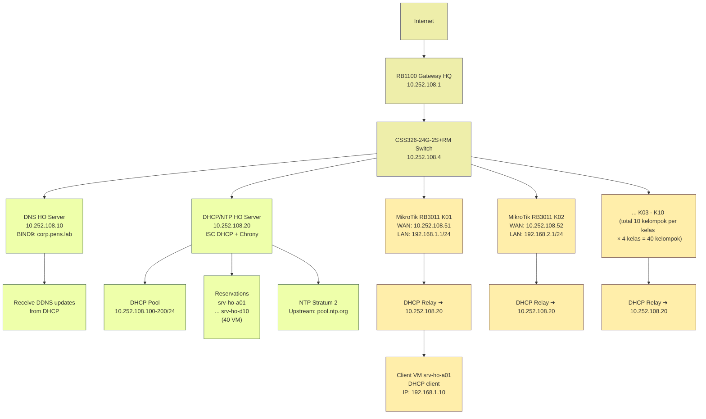

# MINGGU 4: DHCP Server (ISC DHCP) & NTP (Chrony)
**Topik:** Centralized DHCP & NTP Services - ISC DHCP Server + Chrony Time Sync  
**Durasi:** 120 menit  
**Prasyarat:** MINGGU_3 selesai (DNS BIND9 corp.pens.lab running di 10.252.108.10)

---

## 1. TUJUAN PEMBELAJARAN

Setelah praktikum ini, mahasiswa mampu:

1. Menginstal dan mengkonfigurasi ISC DHCP Server sebagai centralized IP management untuk backbone enterprise
2. Setup DHCP pool, lease time, reservations berdasarkan MAC address untuk 40 VM kelompok
3. Konfigurasi DHCP relay di MikroTik RB3011 untuk melayani subnet client (192.168.X.0/24)
4. Integrasi DHCP dengan DNS BIND9 melalui Dynamic DNS (DDNS) update
5. Menginstal Chrony sebagai NTP master server untuk time synchronization seluruh lab
6. Verifikasi DHCP DORA process, lease assignment, dan NTP sync accuracy (<1s offset)

---

## 2. DASAR TEORI

### 2.1 DHCP (Dynamic Host Configuration Protocol)

DHCP mengotomasi assignment IP address, gateway, DNS, NTP ke client via 4-way handshake **DORA**:

**DORA Process:**
1. **Discover (Broadcast):** Client broadcast "DHCPDISCOVER" mencari DHCP server di LAN
2. **Offer (Unicast):** Server reply "DHCPOFFER" dengan IP tersedia + lease time
3. **Request (Broadcast):** Client broadcast "DHCPREQUEST" konfirmasi accept offer
4. **Acknowledge (Unicast):** Server reply "DHCPACK" finalize lease + options (DNS, gateway, NTP)

**DHCP Relay Agent:**
Jika client dan server di subnet berbeda, relay agent (MikroTik RB3011) forward broadcast DHCP ke server via unicast. Contoh: Client 192.168.1.0/24 → RB3011 relay → DHCP server 10.252.108.20.

**Lease Management:**
- **Default Lease Time:** 600s (10 menit) - cepat recycle untuk lab dinamis
- **Max Lease Time:** 7200s (2 jam) - batas maksimum sebelum renewal
- **Reservation:** Fixed IP berdasarkan MAC address untuk server persistent (srv-ho-kXX)

**DHCP Options:**
- `option routers` - Default gateway (10.252.108.1)
- `option domain-name-servers` - DNS servers (10.252.108.10, 10.252.108.20)
- `option domain-name` - Domain suffix (corp.pens.lab)
- `option ntp-servers` - NTP server (10.252.108.20)

### 2.2 Dynamic DNS (DDNS) Update

ISC DHCP dapat auto-update BIND9 zone saat assign/release lease via **rndc-key** (shared secret HMAC-MD5):

**Flow:**
1. Client dapat lease IP 10.252.108.151
2. DHCP server update BIND9 (10.252.108.10) via rndc-key
3. BIND9 tambah A record: `srv-ho-a01.corp.pens.lab. IN A 10.252.108.151`
4. BIND9 tambah PTR reverse: `151.108.252.10.in-addr.arpa. IN PTR srv-ho-a01.corp.pens.lab.`

**Keuntungan:** Hostname DNS selalu sync dengan DHCP lease (no manual update zone file).

### 2.3 NTP (Network Time Protocol) dengan Chrony

**Chrony** adalah modern NTP implementation (superior vs ntpd):
- Faster convergence (sync lebih cepat saat boot)
- Better accuracy di network unstable
- Lower resource usage

**NTP Hierarchy (Stratum):**
- **Stratum 0:** Atomic clock, GPS (hardware reference)
- **Stratum 1:** Server sync langsung ke Stratum 0 (pool.ntp.org servers)
- **Stratum 2:** Server sync ke Stratum 1 (HO server 10.252.108.20)
- **Stratum 3+:** Client sync ke Stratum 2 (VM kelompok, Proxmox)

**Chrony Components:**
- **chronyd:** Daemon NTP server/client
- **chronyc:** CLI tool untuk monitoring (`tracking`, `sources`, `sourcestats`)

**Importance for Cybersecurity:**
- Accurate logging timestamps (incident response, forensics)
- TLS certificate validation (not before/after time)
- Kerberos authentication (time-sensitive tickets)
- SOAR/NIDS correlation events cross-systems

---

## 3. TOPOLOGI LAB



**Skema IP:**
- **Backbone:** 10.252.108.0/24
- **DHCP Pool:** 10.252.108.100-200 (101 addresses untuk dynamic)
- **Reservations:** 10.252.108.151-190 (40 fixed untuk srv-ho-kXX)
- **LAN Kelompok:** 192.168.X.0/24 (X = kelompok 1-10)

**Lihat file terpisah `TABEL_KELOMPOK_DHCP.md` untuk mapping lengkap 40 reservations.**

---

## 4. LANGKAH PRAKTIKUM

### Step 1: Persiapan VM HO DHCP/NTP (IP 10.252.108.20)

Login ke VM dedicated untuk DHCP/NTP server (bisa VM baru atau reuse existing):

```bash
# Update repository
sudo apt update && sudo apt upgrade -y

# Install ISC DHCP Server, Chrony, tools
sudo apt install isc-dhcp-server chrony bind9-dnsutils nano net-tools -y

# Set static IP jika belum (sesuaikan interface enp1s0)
sudo ip addr add 10.252.108.20/24 dev enp1s0
sudo ip route add default via 10.252.108.1

# Verify connectivity
ping -c 3 10.252.108.1   # Gateway
ping -c 3 10.252.108.10  # DNS HO
ping -c 3 8.8.8.8        # Internet
```

**Expected:** Semua ping reply, interface up dengan IP 10.252.108.20.

---

### Step 2: Generate RNDC Key untuk DDNS

Generate shared secret untuk DHCP→BIND9 DDNS update:

```bash
# Generate HMAC-MD5 key
sudo dnssec-keygen -a HMAC-MD5 -b 128 -n USER rndc-key

# Output: Krndc-key.+157+XXXXX.key dan .private
# Extract secret dari .private file
cat Krndc-key.*.private | grep Key:
```

**Example output:**
```
Key: rnDcK3Yh4sh3dS3cr3tAbc123==
```

**Catat secret ini** untuk Step 3 (dhcpd.conf) dan konfigurasi BIND9 di HO nanti.

---

### Step 3: Konfigurasi ISC DHCP Server

#### A. Edit Interface Binding

```bash
sudo nano /etc/default/isc-dhcp-server
```

**Set interface backbone** (ganti `enp1s0` sesuai interface VM Anda):
```
INTERFACESv4="enp1s0"
INTERFACESv6=""
```

**Simpan:** Ctrl+O, Enter, Ctrl+X.

---

#### B. Edit dhcpd.conf (Main Configuration)

```bash
# Backup original
sudo cp /etc/dhcp/dhcpd.conf /etc/dhcp/dhcpd.conf.bak

# Edit config
sudo nano /etc/dhcp/dhcpd.conf
```

**Hapus semua isi lama, copy-paste konfigurasi lengkap ini:**

```
# ISC DHCP Server Configuration - PENS Lab MINGGU_4
# Centralized DHCP for backbone 10.252.108.0/24 + relay to 192.168.X.0/24

# ===== DDNS BIND9 Integration =====
ddns-update-style interim;
ddns-domainname "corp.pens.lab.";
ddns-rev-domainname "in-addr.arpa.";

# RNDC Key (ganti secret dengan hasil dnssec-keygen Step 2)
key rndc-key {
    algorithm hmac-md5;
    secret "rnDcK3Yh4sh3dS3cr3tAbc123==";  # GANTI DENGAN SECRET ANDA
};

# Zone declarations untuk DDNS
zone corp.pens.lab. {
    primary 10.252.108.10;  # DNS HO server
    key rndc-key;
}

zone 108.252.10.in-addr.arpa. {
    primary 10.252.108.10;
    key rndc-key;
}

# ===== Global Options =====
authoritative;
log-facility local7;

# Lease time (lab dinamis, pakai short lease)
default-lease-time 600;      # 10 menit
max-lease-time 7200;         # 2 jam

# DNS update options
update-static-leases on;
update-optimization off;
use-host-decl-names on;

# ===== Subnet Declaration: Backbone 10.252.108.0/24 =====
subnet 10.252.108.0 netmask 255.255.255.0 {
    # Dynamic pool untuk device umum (Proxmox mgmt, tools, testing)
    range 10.252.108.100 10.252.108.150;
    
    # Network options
    option routers 10.252.108.1;                        # Gateway RB1100
    option domain-name-servers 10.252.108.10, 10.252.108.20;  # DNS HO + self
    option domain-name "corp.pens.lab";
    option ntp-servers 10.252.108.20;                   # NTP self
    option broadcast-address 10.252.108.255;
    
    # DDNS hostname pattern
    ddns-hostname = concat("dhcp-", binary-to-ascii(10, 8, "-", leased-address));
}

# ===== Host Reservations: 40 VM srv-ho-kXX =====
# Format: hardware ethernet MAC_ADDRESS; fixed-address IP; option host-name FQDN;

# Kelas A (10 kelompok)
host srv-ho-a01 {
    hardware ethernet 08:00:27:a0:01:01;  # GANTI MAC REAL dari VM
    fixed-address 10.252.108.151;
    option host-name "srv-ho-a01.corp.pens.lab";
}

host srv-ho-a02 {
    hardware ethernet 08:00:27:a0:02:02;
    fixed-address 10.252.108.152;
    option host-name "srv-ho-a02.corp.pens.lab";
}

host srv-ho-a03 {
    hardware ethernet 08:00:27:a0:03:03;
    fixed-address 10.252.108.153;
    option host-name "srv-ho-a03.corp.pens.lab";
}

# ... (total 10 entries Kelas A: .151-.160)
# LIHAT FILE TABEL_KELOMPOK_DHCP.md untuk 40 MAC+IP lengkap

# Kelas B (10 kelompok: .161-.170)
host srv-ho-b01 {
    hardware ethernet 08:00:27:b0:01:01;
    fixed-address 10.252.108.161;
    option host-name "srv-ho-b01.corp.pens.lab";
}

# ... (dst sampai srv-ho-b10 → .170)

# Kelas C (10 kelompok: .171-.180)
host srv-ho-c01 {
    hardware ethernet 08:00:27:c0:01:01;
    fixed-address 10.252.108.171;
    option host-name "srv-ho-c01.corp.pens.lab";
}

# ... (dst sampai srv-ho-c10 → .180)

# Kelas D (10 kelompok: .181-.190)
host srv-ho-d01 {
    hardware ethernet 08:00:27:d0:01:01;
    fixed-address 10.252.108.181;
    option host-name "srv-ho-d01.corp.pens.lab";
}

# ... (dst sampai srv-ho-d10 → .190)

# END OF dhcpd.conf
```

**Catatan penting:**
- **Ganti `secret`** dengan hasil dnssec-keygen Step 2
- **Ganti `hardware ethernet MAC`** dengan MAC real VM (ambil via `ip link show` atau `ifconfig`)
- Template 40 host declaration ada di file terpisah `TABEL_KELOMPOK_DHCP.md`

**Simpan:** Ctrl+O, Enter, Ctrl+X.

---

### Step 4: Validasi Syntax dan Start Service

```bash
# Test syntax config (WAJIB sebelum start)
sudo dhcpd -t -cf /etc/dhcp/dhcpd.conf

# Expected output: "Internet Systems Consortium DHCP Server 4.x ... Wrote 0 leases to ..."
# Jika ada error syntax, perbaiki dulu (cek tanda kurung, semicolon)

# Enable firewall untuk DHCP (port 67/udp server, 68/udp client)
sudo ufw allow 67/udp
sudo ufw allow 68/udp

# Start dan enable service
sudo systemctl restart isc-dhcp-server
sudo systemctl enable isc-dhcp-server

# Verify status (WAJIB running)
sudo systemctl status isc-dhcp-server
```

**Expected output status:**
```
● isc-dhcp-server.service - ISC DHCP IPv4 server
   Loaded: loaded
   Active: active (running) since ...
   Main PID: 12345 (dhcpd)
```

**Monitor log real-time:**
```bash
sudo tail -f /var/log/syslog | grep dhcpd
```

**Jika failed:**
- Cek error: `sudo journalctl -xeu isc-dhcp-server`
- Common issues: syntax error, interface typo, subnet tidak match interface IP

---

### Step 5: Konfigurasi Chrony NTP Master

```bash
sudo nano /etc/chrony/chrony.conf
```

**Edit konfigurasi, tambahkan/modify baris ini:**

```
# Upstream NTP sources (pool.ntp.org Stratum 1)
pool id.pool.ntp.org iburst
pool pool.ntp.org iburst

# Allow clients dari backbone + LAN kelompok via relay
allow 10.252.108.0/24
allow 192.168.0.0/16

# Serve time even if not synced (local stratum 10)
local stratum 10

# Log tracking
log tracking measurements statistics
logdir /var/log/chrony
```

**Simpan:** Ctrl+O, Enter, Ctrl+X.

**Restart Chrony:**
```bash
# Enable firewall NTP (port 123/udp)
sudo ufw allow 123/udp

# Restart service
sudo systemctl restart chrony
sudo systemctl enable chrony

# Verify status
sudo systemctl status chrony
```

**Check NTP sync:**
```bash
# Tracking info
sudo chronyc tracking

# Expected output:
# Reference ID    : POOL_IP (pool.ntp.org)
# Stratum         : 3
# System time     : 0.000XXX seconds fast/slow of NTP time
# Last offset     : +0.000XXX seconds
# RMS offset      : 0.000XXX seconds
```

**System time offset harus <1 second untuk accurate sync.**

**Check upstream sources:**
```bash
sudo chronyc sources

# Expected: ^* (selected) atau ^+ (candidate) untuk pool.ntp.org servers
```

---

### Step 6: Konfigurasi DHCP Relay di MikroTik RB3011

Setiap RB3011 kelompok harus relay DHCP request dari LAN (192.168.X.0/24) ke server (10.252.108.20).

**Via Winbox/WebFig:**

1. Connect Winbox ke RB3011 K01 (10.252.108.51)
2. Menu: **IP → DHCP Relay**
3. Click **[+] Add**
4. Set parameters:
   - **Name:** dhcp-relay-to-ho
   - **Interface:** bridge-LAN (atau interface LAN kelompok)
   - **DHCP Server:** 10.252.108.20
   - **Local Address:** 192.168.1.1 (gateway LAN kelompok)
5. Click **OK**
6. **Apply** dan verify status **enabled**

**Via CLI (Terminal MikroTik):**

```routeros
# Add DHCP relay
/ip dhcp-relay add name=dhcp-relay-to-ho interface=bridge-LAN dhcp-server=10.252.108.20 local-address=192.168.1.1

# Verify
/ip dhcp-relay print
```

**Expected output:**
```
0  name="dhcp-relay-to-ho" interface=bridge-LAN dhcp-server=10.252.108.20 
   local-address=192.168.1.1 delay-threshold=none
```

**Ulangi untuk K02-K10** (ganti interface dan local-address sesuai kelompok dari tabel).

---

### Step 7: Testing DHCP Client (VM Kelompok)

Dari VM client (contoh: srv-ho-a01 di LAN 192.168.1.0/24 via RB3011 K01):

```bash
# Release lease lama (jika ada)
sudo dhclient -r enp1s0

# Request lease baru (pakai interface LAN VM)
sudo dhclient -v enp1s0

# Expected output:
# DHCPDISCOVER on enp1s0 to 255.255.255.255 port 67
# DHCPOFFER from 10.252.108.20
# DHCPREQUEST on enp1s0 to 255.255.255.255 port 67
# DHCPACK from 10.252.108.20
# bound to 10.252.108.151 -- renewal in 300 seconds
```

**Verify IP assignment:**
```bash
ip addr show enp1s0

# Expected: inet 10.252.108.151/24 (reservation) atau 10.252.108.10X (pool)
```

**Verify gateway:**
```bash
ip route show

# Expected: default via 10.252.108.1 dev enp1s0
```

**Verify DNS:**
```bash
cat /etc/resolv.conf

# Expected:
# nameserver 10.252.108.10
# nameserver 10.252.108.20
# search corp.pens.lab
```

**Test DNS resolution:**
```bash
nslookup corp.pens.lab
dig srv-ho-a01.corp.pens.lab @10.252.108.10

# Expected: A record 10.252.108.151 (DDNS auto-update)
```

**Screenshot Test 1 untuk laporan** (ip addr + route + resolv.conf).

---

### Step 8: Verify DDNS Update di DNS HO

Dari DHCP server atau client, test apakah DNS HO (10.252.108.10) sudah receive DDNS update:

```bash
# Query hostname DDNS dari DHCP lease
dig srv-ho-a01.corp.pens.lab @10.252.108.10

# Expected ANSWER SECTION:
# srv-ho-a01.corp.pens.lab. 600 IN A 10.252.108.151
```

**Reverse lookup (PTR):**
```bash
dig -x 10.252.108.151 @10.252.108.10

# Expected ANSWER SECTION:
# 151.108.252.10.in-addr.arpa. 600 IN PTR srv-ho-a01.corp.pens.lab.
```

**Jika NXDOMAIN:**
- DHCP server belum kirim update (cek log `/var/log/syslog | grep dhcpd`)
- BIND9 HO belum konfigurasi rndc-key (koordinasi asisten)
- Zone corp.pens.lab di HO tidak allow-update

**Screenshot Test 2 untuk laporan** (dig forward + reverse DDNS).

---

### Step 9: Testing NTP Sync (Client)

Dari VM client atau Proxmox host, test sync ke Chrony master (10.252.108.20):

**Install Chrony di client (jika belum):**
```bash
sudo apt install chrony -y
```

**Edit /etc/chrony/chrony.conf di client:**
```bash
sudo nano /etc/chrony/chrony.conf
```

**Comment pool.ntp.org, tambah server HO:**
```
# pool pool.ntp.org iburst  # Comment ini
server 10.252.108.20 iburst prefer

# Makestep untuk force sync cepat (lab purpose)
makestep 1 3
```

**Restart Chrony client:**
```bash
sudo systemctl restart chrony

# Force immediate sync (optional)
sudo chronyc makestep

# Check tracking
sudo chronyc tracking
```

**Expected output:**
```
Reference ID    : 0A FC 6C 14 (10.252.108.20)  # HO NTP server
Stratum         : 4                             # Master stratum 3, client 4
System time     : 0.000XXX seconds fast/slow
Last offset     : +0.000XXX seconds
RMS offset      : 0.000XXX seconds
```

**System time offset <1s = good sync.**

**Check sources:**
```bash
sudo chronyc sources -v

# Expected: ^* untuk 10.252.108.20 (selected and synced)
```

**Screenshot Test 3 untuk laporan** (chronyc tracking + sources).

---

### Step 10: Testing Cross-Kelompok

Verifikasi DHCP relay bekerja untuk multiple kelompok:

```bash
# Dari DHCP server, cek lease database
sudo cat /var/lib/dhcp/dhcpd.leases | grep lease

# Expected: lease entries untuk multiple IP (pool + reservations)
```

**Test dari kelompok lain:**
- Login VM srv-ho-b01 (kelas B kelompok 1)
- `sudo dhclient -r && sudo dhclient`
- Verify dapat lease (10.252.108.161 reservation atau pool)
- Test DNS: `nslookup corp.pens.lab`
- Test NTP: `chronyc tracking` (reference 10.252.108.20)

**Screenshot Test 4 untuk laporan** (lease log + cross-kelompok IP).

---

## 5. PERTANYAAN PRE-LAB (Teori)

Jawab sebelum praktikum (tulis di laporan):

1. Jelaskan detail 4 tahap DORA DHCP dan message type masing-masing (broadcast/unicast)?
2. Apa peran DHCP relay agent dan bagaimana forward request cross-subnet?
3. Jelaskan mekanisme DDNS update dari ISC DHCP ke BIND9 via rndc-key?
4. Apa perbedaan `default-lease-time` vs `max-lease-time` dan kapan renewal terjadi?
5. Bagaimana Chrony Stratum hierarchy bekerja (0→1→2→3) dan kenapa time sync penting untuk cybersecurity lab?

---

## 6. PERTANYAAN POST-LAB (Analisis)

Jawab setelah praktikum (tulis di laporan):

6. Analisis log `/var/log/syslog` saat client request lease: identifikasi setiap tahap DORA dengan timestamp!
7. Jika DHCP pool (10.252.108.100-150) habis, apa impact ke 40 kelompok dan bagaimana solusi scaling?
8. Cara troubleshoot jika relay MikroTik tidak forward request ke server (client timeout)?
9. Hitung waktu optimal lease time untuk lab PENS: trade-off antara pool exhaustion vs lease overhead?
10. Bagaimana integrasi DHCP+DNS+NTP ini mendukung SOAR/NIDS deployment di Minggu 8-10 nanti?

---

## 7. FINAL CHECKLIST

Centang sebelum submit laporan:

- [ ] ISC DHCP service running: `systemctl status isc-dhcp-server` active
- [ ] dhcpd.conf syntax valid: `dhcpd -t` no error
- [ ] Pool assign IP baru: client dynamic dapat 10.252.108.10X dengan DNS/NTP options
- [ ] Reservations OK: srv-ho-a01 dapat 10.252.108.151 (fixed)
- [ ] DDNS update BIND9: `dig srv-ho-a01.corp.pens.lab @10.252.108.10` reply A record
- [ ] DDNS PTR reverse: `dig -x 10.252.108.151 @10.252.108.10` reply PTR
- [ ] Relay MikroTik: client di LAN 192.168.X.0/24 dapat lease via relay
- [ ] Chrony NTP master: `chronyc tracking` reference pool.ntp.org, stratum 3
- [ ] Chrony client sync: offset <1s, reference 10.252.108.20
- [ ] Cross-kelompok OK: 2+ VM berbeda kelas dapat lease + DNS + NTP sync
- [ ] 8 screenshot tersimpan (DORA log, IP assignment, DDNS dig, chronyc tracking, lease file, relay verify, cross-kelompok)

---

## 8. TABEL TROUBLESHOOTING

| **Gejala**                         | **Kemungkinan Cause**                | **Fix**                                                      |
|------------------------------------|--------------------------------------|--------------------------------------------------------------|
| `systemctl status` failed         | Syntax error dhcpd.conf             | `dhcpd -t -cf /etc/dhcp/dhcpd.conf`, perbaiki syntax         |
| "No subnet declaration for enp1s0" | Interface tidak match subnet        | Cek INTERFACESv4 di /etc/default/isc-dhcp-server             |
| Client no lease (timeout)         | Firewall block port 67/udp          | `ufw allow 67/udp`, restart isc-dhcp-server                  |
| Pool exhausted                    | Range terlalu kecil                 | Expand range di dhcpd.conf: 100-200 → 100-250                |
| Relay tidak forward               | MikroTik relay config salah         | `/ip dhcp-relay print`, verify interface dan server IP       |
| Relay timeout                     | Routing RB3011→HO broken            | Ping 10.252.108.20 dari RB3011, cek gateway/masquerade       |
| DDNS update gagal                 | rndc-key mismatch DHCP↔BIND9        | Sync secret, restart BIND9 + isc-dhcp-server                 |
| DDNS NXDOMAIN                     | BIND9 HO zone tidak allow-update    | Edit /etc/bind/named.conf.local: allow-update { key rndc-key; } |
| NTP tidak sync                    | Firewall block 123/udp              | `ufw allow 123/udp`, check `chronyc sources`                 |
| Chrony offset >1s                 | Upstream pool.ntp.org unreachable   | Check internet, ganti pool: asia.pool.ntp.org                |
| Client NTP stratum 16 (unsynced)  | Server 10.252.108.20 tidak reachable | Ping server, verify `allow 192.168.0.0/16` di master         |
| Lease tidak persistent            | Reservation MAC typo                | Verify MAC: `ip link show`, update dhcpd.conf exact match    |

---

## 9. FORMAT LAPORAN

Submit via LMS dalam **satu file PDF (max 6 halaman)**:

**Halaman 1: Cover & Data Kelompok**
- Judul: Laporan Praktikum MINGGU 4 - DHCP & NTP
- Nama/NRP anggota kelompok
- Kelas, Kelompok, VM hostname (srv-ho-XXX)
- Tanggal praktikum

**Halaman 2-4: Screenshot Testing (8 gambar wajib)**
1. `sudo dhclient -v` output - DORA process lengkap
2. `ip addr show` + `ip route` + `cat /etc/resolv.conf` - IP/gateway/DNS assignment
3. `dig srv-ho-XXX.corp.pens.lab @10.252.108.10` - DDNS forward lookup
4. `dig -x 10.252.108.XXX @10.252.108.10` - DDNS reverse PTR
5. `sudo cat /var/lib/dhcp/dhcpd.leases` - lease database entries
6. `sudo chronyc tracking` di server - NTP master sync
7. `sudo chronyc tracking` di client - NTP client sync ke 10.252.108.20
8. `/ip dhcp-relay print` dari MikroTik - relay config verify

**Halaman 5: Jawaban Pertanyaan**
- Pre-Lab: soal 1-5 (teori DHCP/NTP)
- Post-Lab: soal 6-10 (analisis log, scaling, troubleshoot, integrasi)
- Bullet points OK, analisis singkat per soal

**Halaman 6: Final Checklist & Kesimpulan**
- Centang semua 11 item checklist
- Kesimpulan praktikum (5-7 kalimat): keberhasilan DHCP centralized, DDNS auto-update, NTP sync accuracy, relay cross-subnet
- Troubleshoot yang dialami (jika ada) dan solusi yang diterapkan

---

## 10. REFERENSI

1. Ubuntu Documentation. (2026). How to install and configure isc-dhcp-server. Canonical Ltd. https://documentation.ubuntu.com/server/how-to/networking/install-isc-dhcp-server/
2. ISC DHCP 4.4 Manual. Internet Systems Consortium. https://kb.isc.org/docs/aa-00333
3. Ubuntu Server Guide. (2026). How to serve the Network Time Protocol with Chrony. Canonical Ltd. https://documentation.ubuntu.com/server/how-to/networking/serve-ntp-with-chrony/
4. Mills, D., Martin, J., Burbank, J., & Kasch, W. (2010). Network Time Protocol Version 4: Protocol and Algorithms Specification. RFC 5905. IETF.
5. Lichvar, M. (2024). Chrony: Versatile implementation of NTP. Red Hat Documentation. https://chrony.tuxfamily.org/
6. MikroTik Wiki. (2025). DHCP Relay Configuration. MikroTik RouterOS Documentation. https://wiki.mikrotik.com/wiki/Manual:IP/DHCP_Relay

---

Durasi: 120 menit | Difficulty: Intermediate  
Next: MINGGU_5 Nginx Reverse Proxy & Load Balancing

**Lihat file terpisah:** `TABEL_KELOMPOK_DHCP.md` untuk mapping 40 MAC addresses + IP reservations lengkap.
