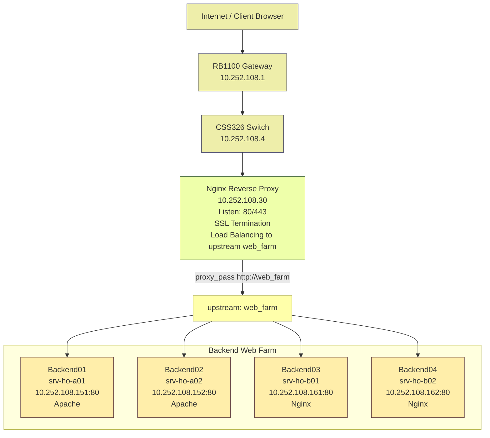

# MINGGU 5: Nginx Reverse Proxy & Load Balancing

**Topik:** Nginx as Reverse Proxy with Load Balancing & SSL Termination  
**Durasi:** 120 menit  
**Prasyarat:** MINGGU_4 selesai (DHCP reservations 10.252.108.151-190 active)

---

## 1. TUJUAN PEMBELAJARAN

Setelah praktikum ini, mahasiswa mampu:

1. Menginstal dan mengkonfigurasi Nginx sebagai reverse proxy server untuk web farm backend
2. Setup upstream block dengan multiple backend servers (load balancing pool)
3. Implementasi load balancing algorithms: round-robin, least_conn, ip_hash, weighted
4. Konfigurasi proxy headers (X-Real-IP, X-Forwarded-For, Host) untuk backend identification
5. Implementasi SSL/TLS termination di proxy layer dengan certificate management
6. Setup passive health checks via proxy_next_upstream untuk high availability
7. Monitoring dan troubleshooting load balancer performance dengan access logs

---

## 2. DASAR TEORI

### 2.1 Reverse Proxy Concept

**Reverse Proxy** adalah server yang duduk di depan backend servers, menerima client requests dan forward ke upstream backend. Berbeda dengan forward proxy (client-side), reverse proxy server-side untuk:

**Fungsi Utama:**
- **Load Balancing:** Distribusi traffic ke multiple backends
- **SSL Termination:** Decrypt HTTPS di proxy, forward HTTP ke backend (offload SSL overhead)
- **Caching:** Cache static content, reduce backend load
- **Security:** Hide backend topology, WAF integration, rate limiting
- **Compression:** Gzip responses sebelum kirim ke client
- **Centralized Logging:** Single point untuk monitoring semua backend traffic

**Flow:**
```
Client → Nginx Proxy (10.252.108.30:443)
           ↓ decrypt SSL
           ↓ select backend (load balancing)
           ↓ proxy_pass HTTP
        Backend Web Servers (10.252.108.151-190:80)
           ↓ HTTP response
        Nginx (encrypt SSL)
           ↓
        Client (HTTPS response)
```

### 2.2 Nginx Load Balancing Methods

Nginx mendukung beberapa algoritma load balancing di `upstream` block:

**1. Round-Robin (Default)**
```nginx
upstream web_farm {
    server 10.252.108.151;
    server 10.252.108.152;
    server 10.252.108.153;
}
```
Request distribusi sequential: 151 → 152 → 153 → 151 → ...  
**Use case:** Backends homogen (sama spec hardware/software).

**2. Least Connections**
```nginx
upstream web_farm {
    least_conn;
    server 10.252.108.151;
    server 10.252.108.152;
}
```
Request dikirim ke server dengan koneksi aktif paling sedikit.  
**Use case:** Backends heterogen atau request processing time vary.

**3. IP Hash (Session Persistence)**
```nginx
upstream web_farm {
    ip_hash;
    server 10.252.108.151;
    server 10.252.108.152;
}
```
Client IP hash menentukan backend (same client → same server).  
**Use case:** Session affinity (PHP session, shopping cart tanpa shared storage).

**4. Weighted Distribution**
```nginx
upstream web_farm {
    server 10.252.108.151 weight=3;  # 60% traffic (3/5)
    server 10.252.108.152 weight=2;  # 40% traffic (2/5)
}
```
Distribusi berdasarkan weight ratio.  
**Use case:** Backends dengan kapasitas berbeda (server lebih powerful dapat weight lebih tinggi).

**5. Hash (Generic Key)**
```nginx
upstream web_farm {
    hash $request_uri consistent;
    server 10.252.108.151;
    server 10.252.108.152;
}
```
Hash based on custom key (URI, cookie, header).  
**Use case:** Cache efficiency (same URL → same backend cache).

### 2.3 Health Checks

**Passive Health Checks (Free, Default):**
Nginx otomatis tandai backend sebagai unavailable jika timeout/error response, retry dengan `proxy_next_upstream`.

```nginx
proxy_next_upstream error timeout http_502 http_503 http_504;
proxy_next_upstream_tries 3;
proxy_next_upstream_timeout 30s;
```

**Parameters:**
- `max_fails=3`: Backend marked down after 3 consecutive failures
- `fail_timeout=30s`: Wait 30s before retry downed backend
- `proxy_connect_timeout=5s`: Timeout establishing connection ke backend
- `proxy_read_timeout=60s`: Timeout reading response dari backend

**Active Health Checks (Nginx Plus):**
Periodic health check requests (HTTP GET /health) independent dari client traffic.  
**Lab PENS:** Pakai passive checks (free version).

### 2.4 Proxy Headers

Saat Nginx forward request ke backend, origin client info hilang (backend hanya lihat Nginx IP). Proxy headers restore client info:

**Essential Headers:**
```nginx
proxy_set_header Host $host;
# Backend menerima original Host header (virtual host routing)

proxy_set_header X-Real-IP $remote_addr;
# Client IP asli untuk logging/geolocation backend

proxy_set_header X-Forwarded-For $proxy_add_x_forwarded_for;
# Proxy chain: client IP + intermediate proxies

proxy_set_header X-Forwarded-Proto $scheme;
# Original protocol (http/https) untuk backend redirect logic

proxy_set_header X-Forwarded-Host $host;
# Original hostname dari client request

proxy_set_header Connection "";
# Disable Connection header untuk HTTP/1.1 keepalive upstream
```

**Backend Apache/PHP dapat baca:**
```php
$client_ip = $_SERVER['HTTP_X_REAL_IP'];  // 10.1.2.3 (client)
$protocol = $_SERVER['HTTP_X_FORWARDED_PROTO'];  // https
```

### 2.5 SSL/TLS Termination

**SSL Termination:** Nginx decrypt HTTPS dari client, forward HTTP plain ke backend.

**Keuntungan:**
- Backend tidak perlu handle SSL overhead (CPU intensive)
- Centralized certificate management (1 cert di proxy vs 40 certs di backends)
- Simplified backend configuration (no SSL setup Apache/Nginx backend)
- SSL offloading dari backend = lebih banyak resource untuk aplikasi

**Flow:**
```
Client --HTTPS--> Nginx Proxy (cert+key) --HTTP--> Backend
                    ↓ decrypt               ↓ plain
                   443                      80
```

**Lab Setup:**
- Nginx listen 443 ssl dengan self-signed certificate (produksi: Let's Encrypt)
- Backend listen 80 HTTP only

---

## 3. TOPOLOGI LAB



**IP Scheme:**
- **Proxy:** 10.252.108.30 (dedicated VM atau reuse VM HO)
- **Backends:** 10.252.108.151-162 (DHCP reservations dari MINGGU_4)
- **DNS:** proxy.corp.pens.lab → 10.252.108.30 (A record di BIND9 HO)

**Lihat file `TABEL_KELOMPOK_NGINX.md` untuk mapping 40 upstream backends lengkap.**

---

## 4. LANGKAH PRAKTIKUM

### Step 1: Setup Backend Web Servers (4 VM Kelompok)

Setiap kelompok siapkan 1 VM sebagai backend. Lab demo pakai 4 backends (A01, A02, B01, B02).

**A. Install Apache di srv-ho-a01 (10.252.108.151):**

```bash
# Login VM A01
ssh user@10.252.108.151

# Update dan install Apache
sudo apt update
sudo apt install apache2 -y

# Enable dan start
sudo systemctl enable apache2
sudo systemctl start apache2

# Verify Apache running
sudo systemctl status apache2
curl localhost
# Expected: Apache2 Ubuntu Default Page
```

**B. Custom index.html (identifikasi backend):**

```bash
# Edit default page
sudo nano /var/www/html/index.html
```

**Isi (ganti identitas per VM):**
```html
<!DOCTYPE html>
<html>
<head>
    <title>Backend A01</title>
    <style>
        body { font-family: Arial; text-align: center; padding: 50px; background: #e3f2fd; }
        h1 { color: #1976d2; }
        .info { background: white; padding: 20px; border-radius: 10px; display: inline-block; }
    </style>
</head>
<body>
    <div class="info">
        <h1>Backend Server: srv-ho-a01</h1>
        <p><strong>IP:</strong> 10.252.108.151</p>
        <p><strong>Hostname:</strong> <?php echo gethostname(); ?></p>
        <p><strong>Software:</strong> Apache 2.4</p>
        <p><strong>Kelas:</strong> A | <strong>Kelompok:</strong> 01</p>
        <hr>
        <p>Client IP: <?php echo $_SERVER['HTTP_X_REAL_IP'] ?? $_SERVER['REMOTE_ADDR']; ?></p>
        <p>Request Time: <?php echo date('Y-m-d H:i:s'); ?></p>
    </div>
</body>
</html>
```

**Install PHP (jika pakai PHP tags):**
```bash
sudo apt install php libapache2-mod-php -y
sudo systemctl restart apache2

# Rename ke PHP file
sudo mv /var/www/html/index.html /var/www/html/index.php
```

**Test:**
```bash
curl http://10.252.108.151
# Expected: HTML dengan "Backend Server: srv-ho-a01"
```

**C. Ulangi untuk backend lain (A02, B01, B02):**

Ganti:
- `srv-ho-a02` → 10.252.108.152
- `srv-ho-b01` → 10.252.108.161 (bisa pakai Nginx backend)
- `srv-ho-b02` → 10.252.108.162

**Untuk Nginx backend (alternatif):**
```bash
sudo apt install nginx -y
echo "<h1>Backend B01 - Nginx</h1><p>IP: 10.252.108.161</p>" | sudo tee /var/www/html/index.html
sudo systemctl restart nginx
```

**Screenshot Test 1 untuk laporan:** curl output 4 backends menampilkan identitas berbeda.

---

### Step 2: Setup Nginx Reverse Proxy (VM Proxy 10.252.108.30)

**A. Install Nginx:**

```bash
# Login VM Proxy
ssh user@10.252.108.30

# Install
sudo apt update
sudo apt install nginx -y

# Verify version (harus 1.18+)
nginx -v

# Enable firewall
sudo ufw allow 'Nginx Full'  # Port 80 dan 443
sudo ufw status
```

**B. Backup default config:**
```bash
sudo cp /etc/nginx/nginx.conf /etc/nginx/nginx.conf.bak
sudo cp /etc/nginx/sites-available/default /etc/nginx/sites-available/default.bak
```

---

### Step 3: Konfigurasi Upstream Block (Load Balancer Pool)

**Edit /etc/nginx/sites-available/proxy:**

```bash
sudo nano /etc/nginx/sites-available/proxy
```

**Konfigurasi lengkap:**

```nginx
# Upstream block: define backend pool
upstream web_farm {
    # Load balancing method: least_conn (pilih server dengan koneksi paling sedikit)
    least_conn;

    # Backend servers dengan health check parameters
    server 10.252.108.151:80 weight=1 max_fails=3 fail_timeout=30s;  # srv-ho-a01
    server 10.252.108.152:80 weight=1 max_fails=3 fail_timeout=30s;  # srv-ho-a02
    server 10.252.108.161:80 weight=2 max_fails=3 fail_timeout=30s;  # srv-ho-b01 (lebih kuat)
    server 10.252.108.162:80 weight=1 max_fails=3 fail_timeout=30s;  # srv-ho-b02

    # Keepalive connections ke backend (performance optimization)
    keepalive 32;
}

# HTTP Server Block (port 80)
server {
    listen 80;
    listen [::]:80;
    server_name proxy.corp.pens.lab 10.252.108.30;

    # Access log dengan upstream info
    access_log /var/log/nginx/proxy_access.log;
    error_log /var/log/nginx/proxy_error.log;

    # Location block: proxy ke upstream
    location / {
        # Proxy pass ke upstream pool
        proxy_pass http://web_farm;

        # Proxy headers: forward client info ke backend
        proxy_set_header Host $host;
        proxy_set_header X-Real-IP $remote_addr;
        proxy_set_header X-Forwarded-For $proxy_add_x_forwarded_for;
        proxy_set_header X-Forwarded-Proto $scheme;
        proxy_set_header X-Forwarded-Host $host;

        # HTTP version dan keepalive
        proxy_http_version 1.1;
        proxy_set_header Connection "";

        # Timeouts
        proxy_connect_timeout 5s;
        proxy_send_timeout 60s;
        proxy_read_timeout 60s;

        # Buffering
        proxy_buffering on;
        proxy_buffer_size 4k;
        proxy_buffers 8 4k;

        # Health check: retry pada error/timeout
        proxy_next_upstream error timeout http_502 http_503 http_504;
        proxy_next_upstream_tries 3;
        proxy_next_upstream_timeout 30s;
    }

    # Health check endpoint (optional)
    location /nginx_status {
        stub_status on;
        access_log off;
        allow 10.252.108.0/24;  # Only from backbone
        deny all;
    }
}

# HTTPS Server Block (port 443) - SSL Termination
server {
    listen 443 ssl http2;
    listen [::]:443 ssl http2;
    server_name proxy.corp.pens.lab 10.252.108.30;

    # SSL Certificate (self-signed untuk lab, produksi: Let's Encrypt)
    ssl_certificate /etc/nginx/ssl/proxy.crt;
    ssl_certificate_key /etc/nginx/ssl/proxy.key;

    # SSL protocols dan ciphers (modern config)
    ssl_protocols TLSv1.2 TLSv1.3;
    ssl_ciphers 'ECDHE-ECDSA-AES128-GCM-SHA256:ECDHE-RSA-AES128-GCM-SHA256';
    ssl_prefer_server_ciphers off;

    # SSL session cache
    ssl_session_cache shared:SSL:10m;
    ssl_session_timeout 10m;

    # HSTS (optional)
    add_header Strict-Transport-Security "max-age=31536000" always;

    # Access log
    access_log /var/log/nginx/proxy_ssl_access.log;
    error_log /var/log/nginx/proxy_ssl_error.log;

    # Proxy ke upstream (same as HTTP)
    location / {
        proxy_pass http://web_farm;  # Backend tetap HTTP (SSL termination)

        # Proxy headers (tambah HTTPS indicator)
        proxy_set_header Host $host;
        proxy_set_header X-Real-IP $remote_addr;
        proxy_set_header X-Forwarded-For $proxy_add_x_forwarded_for;
        proxy_set_header X-Forwarded-Proto https;  # Tell backend original was HTTPS
        proxy_set_header X-Forwarded-Host $host;

        proxy_http_version 1.1;
        proxy_set_header Connection "";

        # Timeouts dan health check (same as HTTP)
        proxy_connect_timeout 5s;
        proxy_send_timeout 60s;
        proxy_read_timeout 60s;

        proxy_next_upstream error timeout http_502 http_503 http_504;
        proxy_next_upstream_tries 3;
        proxy_next_upstream_timeout 30s;
    }
}
```

**Simpan:** Ctrl+O, Enter, Ctrl+X.

---

### Step 4: Generate Self-Signed SSL Certificate

Untuk SSL termination di port 443, generate certificate dulu:

```bash
# Buat direktori SSL
sudo mkdir -p /etc/nginx/ssl

# Generate private key dan certificate (self-signed, valid 365 hari)
sudo openssl req -x509 -nodes -days 365 -newkey rsa:2048 \
  -keyout /etc/nginx/ssl/proxy.key \
  -out /etc/nginx/ssl/proxy.crt \
  -subj "/C=ID/ST=East Java/L=Surabaya/O=PENS/OU=IT/CN=proxy.corp.pens.lab"

# Verify files created
ls -lh /etc/nginx/ssl/

# Expected: proxy.key (private key) dan proxy.crt (certificate)
```

**Set permissions:**
```bash
sudo chmod 600 /etc/nginx/ssl/proxy.key
sudo chmod 644 /etc/nginx/ssl/proxy.crt
```

**Produksi:** Pakai Let's Encrypt certbot untuk valid public certificate.

---

### Step 5: Enable Config dan Test Syntax

```bash
# Enable site (symlink ke sites-enabled)
sudo ln -s /etc/nginx/sites-available/proxy /etc/nginx/sites-enabled/

# Disable default site (optional, hindari konflik)
sudo rm /etc/nginx/sites-enabled/default

# Test syntax config (WAJIB sebelum reload)
sudo nginx -t

# Expected output:
# nginx: the configuration file /etc/nginx/nginx.conf syntax is ok
# nginx: configuration file /etc/nginx/nginx.conf test is successful
```

**Jika error syntax:**
- Cek kurung kurawal `{ }` balance
- Cek semicolon `;` di akhir directive
- Cek typo server IP/port

**Reload Nginx:**
```bash
sudo systemctl reload nginx
sudo systemctl status nginx

# Verify listening ports
sudo ss -tlnp | grep nginx

# Expected:
# 0.0.0.0:80   (HTTP)
# 0.0.0.0:443  (HTTPS)
```

---

### Step 6: DNS Configuration (BIND9 HO)

Tambah A record untuk proxy.corp.pens.lab di DNS HO (10.252.108.10):

```bash
# SSH ke DNS HO
ssh user@10.252.108.10

# Edit zone file
sudo nano /etc/bind/db.corp.pens.lab
```

**Tambahkan entry:**
```
proxy           IN      A       10.252.108.30
```

**Reload DNS:**
```bash
sudo named-checkzone corp.pens.lab /etc/bind/db.corp.pens.lab
sudo rndc reload corp.pens.lab
```

**Test resolusi:**
```bash
dig proxy.corp.pens.lab @10.252.108.10

# Expected ANSWER SECTION:
# proxy.corp.pens.lab. 86400 IN A 10.252.108.30
```

---

### Step 7: Testing Load Balancing (HTTP Port 80)

**A. Test dari proxy server (localhost):**

```bash
# Loop 10 requests
for i in {1..10}; do
  curl -s http://localhost | grep "Backend Server"
done

# Expected: Rotasi antara A01, A02, B01, B02 (least_conn algorithm)
# Backend Server: srv-ho-a01
# Backend Server: srv-ho-b01
# Backend Server: srv-ho-a02
# Backend Server: srv-ho-b02
# ... (distribusi sesuai weight dan koneksi aktif)
```

**B. Test dengan X-Real-IP header (verify backend receives client IP):**

```bash
curl -H "X-Real-IP: 192.168.1.100" http://localhost

# Check backend log (Apache)
ssh user@10.252.108.151
sudo tail /var/log/apache2/access.log

# Expected: 10.252.108.30 (proxy IP) tetapi X-Real-IP header ada
```

**C. Test dari client eksternal (browser):**

```
http://proxy.corp.pens.lab
atau
http://10.252.108.30
```

Refresh halaman multiple kali → observe backend rotation (A01 → B01 → A02 → B02).

**Screenshot Test 2 untuk laporan:** Browser menampilkan rotasi 4 backends berbeda setelah refresh.

---

### Step 8: Testing SSL Termination (HTTPS Port 443)

**A. Test HTTPS dari proxy server:**

```bash
# Test dengan curl (ignore self-signed cert warning)
curl -k https://localhost | grep "Backend Server"

# Expected: Backend response (same as HTTP, tapi via HTTPS)
```

**B. Test dari browser dengan HTTPS:**

```
https://proxy.corp.pens.lab
atau
https://10.252.108.30
```

**Expected:** Browser warning "Your connection is not private" (self-signed cert) → Click "Advanced" → "Proceed to site" → see backend page.

**C. Verify backend receives HTTPS indicator:**

Backend PHP dapat cek:
```php
<?php
echo $_SERVER['HTTP_X_FORWARDED_PROTO'];  // Output: https
?>
```

**Screenshot Test 3 untuk laporan:** Browser HTTPS lock icon (warning) + backend page displayed.

---

### Step 9: Testing Health Checks (Passive)

Simulasi backend down dan observe Nginx failover:

**A. Stop salah satu backend (contoh: A01):**

```bash
# SSH ke srv-ho-a01
ssh user@10.252.108.151

# Stop Apache
sudo systemctl stop apache2
sudo systemctl status apache2
# Expected: inactive (dead)
```

**B. Test dari proxy:**

```bash
# Loop requests
for i in {1..20}; do
  curl -s http://localhost | grep "Backend Server"
  sleep 1
done

# Expected: Tidak ada A01 dalam rotasi, hanya A02/B01/B02
# Nginx otomatis skip A01 setelah 3 consecutive failures (max_fails=3)
```

**C. Check Nginx error log:**

```bash
sudo tail -f /var/log/nginx/proxy_error.log

# Expected:
# upstream timed out (110: Connection timed out) while connecting to upstream
# no live upstreams while connecting to upstream
```

**D. Restore backend A01:**

```bash
ssh user@10.252.108.151
sudo systemctl start apache2
```

After `fail_timeout=30s`, Nginx retry A01 dan include kembali dalam pool.

**Screenshot Test 4 untuk laporan:** Log showing A01 down → failover ke backends lain → A01 restored.

---

### Step 10: Monitoring dengan Access Logs

Nginx log setiap request dengan backend info (via `$upstream_addr` variable).

**A. Enable custom log format (optional):**

Edit `/etc/nginx/nginx.conf` di http block:

```nginx
log_format upstreamlog '$remote_addr - $remote_user [$time_local] '
                       '"$request" $status $body_bytes_sent '
                       '"$http_user_agent" upstream: $upstream_addr '
                       'upstream_status: $upstream_status '
                       'upstream_response_time: $upstream_response_time';
```

**B. Update access_log directive di site config:**

```nginx
access_log /var/log/nginx/proxy_access.log upstreamlog;
```

**C. Reload dan test:**

```bash
sudo nginx -t && sudo systemctl reload nginx

curl http://localhost

# Check log
sudo tail /var/log/nginx/proxy_access.log

# Expected output:
# 127.0.0.1 - - [22/Feb/2026:10:30:45 +0700] "GET / HTTP/1.1" 200 1234 
# upstream: 10.252.108.151:80 upstream_status: 200 upstream_response_time: 0.025
```

**Screenshot Test 5 untuk laporan:** Access log showing upstream backend IP dan response time.

---

## 5. PERTANYAAN PRE-LAB (Teori)

Jawab sebelum praktikum (tulis di laporan):

1. Jelaskan perbedaan forward proxy vs reverse proxy dengan contoh use case masing-masing?
2. Apa keuntungan SSL termination di reverse proxy layer dibanding SSL di setiap backend?
3. Bandingkan load balancing methods: round-robin vs least_conn vs ip_hash. Kapan pakai masing-masing?
4. Jelaskan fungsi proxy_set_header X-Real-IP dan X-Forwarded-For. Kenapa penting untuk backend logging?
5. Apa itu passive health check di Nginx dan bagaimana mekanisme `proxy_next_upstream` bekerja?

---

## 6. PERTANYAAN POST-LAB (Analisis)

Jawab setelah praktikum (tulis di laporan):

6. Analisis access log proxy: hitung distribusi traffic ke 4 backends selama 100 requests dengan least_conn. Apakah sesuai weight config?
7. Jika salah satu backend down (max_fails reached), berapa lama waktu failover sampai traffic full ke backends lain?
8. Bandingkan response time rata-rata HTTP (port 80) vs HTTPS (port 443). Apa cause latency difference?
9. Cara troubleshoot jika semua backends healthy tapi proxy return "502 Bad Gateway" ke client?
10. Bagaimana integrasi Nginx proxy ini dengan NIDS Mata Elang di Minggu 8 nanti (monitoring backend attacks)?

---

## 7. FINAL CHECKLIST

Centang sebelum submit laporan:

- [ ] Nginx proxy installed: `nginx -v` return version 1.18+
- [ ] 4 Backend web servers running (A01/A02/B01/B02): curl return custom HTML
- [ ] Upstream block configured dengan least_conn dan weight parameters
- [ ] Proxy headers configured: X-Real-IP, X-Forwarded-For, Host
- [ ] HTTP port 80 load balancing OK: refresh browser rotate backends
- [ ] SSL certificate generated: /etc/nginx/ssl/proxy.crt exists
- [ ] HTTPS port 443 working: `curl -k https://localhost` return response
- [ ] SSL termination verified: backend receives X-Forwarded-Proto: https
- [ ] Passive health check tested: 1 backend down, traffic failover ke lain
- [ ] Access logs capture upstream info: backend IP dan response time visible
- [ ] 8 screenshot tersimpan (backends, HTTP test, HTTPS test, logs, health check, monitoring)

---

## 8. TABEL TROUBLESHOOTING

| **Gejala**                          | **Kemungkinan Cause**              | **Fix**                                                        |
|-------------------------------------|-------------------------------------|----------------------------------------------------------------|
| `nginx -t` syntax error            | Typo config, missing semicolon     | Check error line number, verify brackets balance               |
| "502 Bad Gateway"                  | Backend down atau unreachable      | `curl backend_ip:80`, check firewall, verify upstream IPs      |
| "Connection refused upstream"      | Backend service stopped            | `systemctl status apache2`, restart backend                    |
| No load balancing (sama backend)   | IP hash sticky atau keepalive      | Change method ke round-robin, restart Nginx                     |
| SSL certificate error              | Self-signed cert tidak trusted     | Browser: ignore warning atau install cert di trusted CA        |
| Backend tidak terima X-Real-IP     | Proxy header typo                  | Check `proxy_set_header` spelling, reload Nginx                 |
| Health check tidak failover        | `max_fails` terlalu tinggi         | Reduce max_fails=1, fail_timeout=10s untuk faster detection    |
| High latency HTTPS                 | SSL handshake overhead             | Enable `ssl_session_cache`, upgrade ke TLSv1.3                  |
| Access log tidak show upstream     | Custom log format tidak enabled    | Add `$upstream_addr` ke log_format, reload                      |
| Port 443 not listening             | SSL config missing atau typo       | Check `listen 443 ssl`, verify cert paths, restart Nginx        |
| Upstream timeout                   | Backend slow atau overload         | Increase `proxy_read_timeout`, scale backends                   |
| DNS proxy.corp.pens.lab NXDOMAIN   | A record tidak ada di BIND9        | Add `proxy IN A 10.252.108.30`, rndc reload                     |

---

## 9. FORMAT LAPORAN

Submit via LMS dalam **satu file PDF (max 7 halaman)**:

**Halaman 1: Cover & Data Kelompok**
- Judul: Laporan Praktikum MINGGU 5 - Nginx Reverse Proxy & Load Balancing
- Nama/NRP anggota kelompok
- Kelas, Kelompok, VM proxy hostname
- Tanggal praktikum

**Halaman 2-5: Screenshot Testing (8 gambar wajib)**
1. `curl` output 4 backends (A01/A02/B01/B02) dengan identitas berbeda
2. Browser HTTP test: refresh multiple kali menampilkan rotasi backends
3. `nginx -t` syntax test successful + `systemctl status nginx` active
4. Browser HTTPS test: lock icon + backend page displayed (SSL termination)
5. Backend log Apache: showing X-Real-IP header dari client
6. Health check test: backend down → Nginx error log + failover ke lain
7. Access log dengan upstream info: backend IP, status, response time
8. `ss -tlnp | grep nginx`: port 80 dan 443 listening

**Halaman 6: Jawaban Pertanyaan**
- Pre-Lab: soal 1-5 (teori reverse proxy, SSL termination, load balancing, headers, health checks)
- Post-Lab: soal 6-10 (analisis log, failover time, latency comparison, troubleshooting, integrasi NIDS)
- Analisis singkat per soal dengan data dari testing

**Halaman 7: Final Checklist & Kesimpulan**
- Centang semua 11 item checklist
- Kesimpulan praktikum (5-7 kalimat):
  - Keberhasilan reverse proxy dengan load balancing 4 backends
  - SSL termination mengurangi overhead backend
  - Health check passive menjaga high availability
  - Proxy headers preserve client info untuk backend logging
- Troubleshoot yang dialami (jika ada) dan solusi yang diterapkan

---

## 10. ADVANCED: LOAD BALANCING STRATEGIES

Untuk kelompok yang ingin eksplorasi lebih lanjut (optional, bonus point):

### A. Weighted Load Balancing Optimization

Ukur kapasitas real backend dengan `ab` (Apache Bench), assign weight proporsional:

```bash
# Test backend A01
ab -n 1000 -c 10 http://10.252.108.151/

# Output: Requests per second: 450 [#/sec]

# Test backend B01 (lebih powerful)
ab -n 1000 -c 10 http://10.252.108.161/

# Output: Requests per second: 900 [#/sec]
```

**Optimal weight config:**
```nginx
upstream web_farm {
    server 10.252.108.151 weight=1;  # 450 req/s
    server 10.252.108.161 weight=2;  # 900 req/s (2x capacity)
}
```

### B. Session Persistence dengan Cookie

Untuk aplikasi stateful (PHP session tanpa shared storage):

```nginx
upstream web_farm {
    ip_hash;  # Same client IP → same backend
    server 10.252.108.151;
    server 10.252.108.152;
}
```

Atau pakai sticky cookie module (Nginx Plus atau third-party):
```nginx
upstream web_farm {
    server 10.252.108.151;
    server 10.252.108.152;
    sticky cookie srv_id expires=1h path=/;
}
```

### C. Active Health Checks Simulation

Nginx free version tidak support active checks, tapi bisa simulate dengan cron + external script:

```bash
#!/bin/bash
# health_check.sh - Check backends dan update upstream config

BACKENDS=("10.252.108.151" "10.252.108.152" "10.252.108.161" "10.252.108.162")

for backend in "${BACKENDS[@]}"; do
  if curl -sf http://$backend/health > /dev/null; then
    echo "$backend is UP"
    # Enable di upstream (remove 'down' parameter)
  else
    echo "$backend is DOWN"
    # Disable di upstream (add 'down' parameter)
    # Reload Nginx
  fi
done
```

Run via cron every 30 seconds.

---

## 11. REFERENSI

1. NGINX Documentation. (2025). NGINX Reverse Proxy. NGINX Inc. https://docs.nginx.com/nginx/admin-guide/web-server/reverse-proxy/
2. DigitalOcean. (2025). How To Configure Nginx as a Reverse Proxy on Ubuntu 22.04. DigitalOcean Community. https://www.digitalocean.com/community/tutorials/how-to-configure-nginx-as-a-reverse-proxy-on-ubuntu-22-04
3. NGINX Documentation. (2025). HTTP Load Balancing. NGINX Inc. https://docs.nginx.com/nginx/admin-guide/load-balancer/http-load-balancer/
4. NGINX Documentation. (2025). HTTP Health Checks. NGINX Inc. https://docs.nginx.com/nginx/admin-guide/load-balancer/http-health-check/
5. NGINX Documentation. (2025). Securing HTTP Traffic to Upstream Servers. NGINX Inc. https://docs.nginx.com/nginx/admin-guide/security-controls/securing-http-traffic-upstream/
6. Ubuntu Documentation. (2025). Install and configure Nginx. Canonical Ltd. https://ubuntu.com/tutorials/install-and-configure-nginx

---

Durasi: 120 menit | Difficulty: Intermediate-Advanced  
Next: MINGGU_6 LDAP Authentication & Centralized User Management

**Lihat file terpisah:** `TABEL_KELOMPOK_NGINX.md` untuk mapping 40 upstream backends lengkap dengan weight recommendations.
