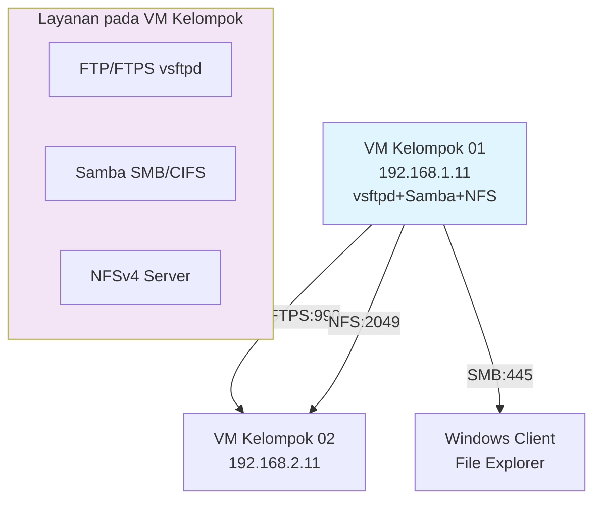

# MINGGU 6 - Layanan Transfer dan Berbagi Berkas

**Mata Kuliah:** Administrasi Sistem & Jaringan  
**Durasi:** 120 menit per kelas  


***

## Tujuan Pembelajaran

Setelah menyelesaikan praktikum Minggu 6, mahasiswa diharapkan mampu:

1. Memahami dan mengimplementasikan tiga protokol file sharing: FTP, Samba (SMB/CIFS), dan NFS
2. Mengkonfigurasi **vsftpd** dengan chroot jail dan enkripsi FTPS untuk keamanan transfer berkas
3. Mengimplementasikan **Samba** untuk berbagi berkas cross-platform (Linux-Windows)
4. Mengkonfigurasi **NFSv4** dengan kontrol akses berbasis host dan user mapping
5. Melakukan benchmark performa transfer berkas antar ketiga protokol
6. Mengimplementasikan best practices keamanan untuk layanan file sharing
7. Menganalisis perbedaan use case dan performa masing-masing protokol
8. Mendokumentasikan konfigurasi dan hasil benchmark dalam laporan akademik [youstable](https://www.youstable.com/blog/how-to-configure-ftp-on-linux)

***

## Deskripsi Praktikum

Praktikum ini melanjutkan infrastruktur enterprise dari Minggu 1-5 dengan implementasi **File Sharing Services** pada VM Ubuntu Server per kelompok:

- **FTP Server:** vsftpd dengan chroot jail dan FTPS (SSL/TLS encryption)
- **Samba Server:** SMB/CIFS untuk akses Windows client dan file sharing antar kelompok
- **NFS Server:** Network File System v4 untuk Linux-to-Linux high-performance sharing
- **Benchmark:** Perbandingan kecepatan transfer 1GB file antar protokol

Setiap kelompok akan mengkonfigurasi ketiga layanan pada VM Ubuntu mereka (192.168.X.11) dan menguji akses dari VM lain dalam lab environment.

***

## Topologi Layanan File Sharing



***

## Persiapan Lingkungan (5 menit)

Pastikan VM Ubuntu Server sudah berjalan dengan konektivitas internet penuh dari Minggu 1-5:

```bash
# Verifikasi konektivitas
ping -c 3 10.252.108.1    # HQ Gateway
ping -c 3 10.252.108.10   # DNS Server
ping -c 3 google.com      # Internet
    
# Update sistem
sudo apt update && sudo apt upgrade -y
```

***

## Langkah 1: Konfigurasi FTP Server vsftpd (30 menit)

### 1.1 Instalasi dan Konfigurasi Dasar

```bash
# Install vsftpd
sudo apt install vsftpd -y

# Backup konfigurasi default
sudo cp /etc/vsftpd.conf /etc/vsftpd.conf.backup

# Buat user FTP khusus kelompok
sudo useradd -m ftpuser -s /bin/false -d /srv/ftp-kelompok
echo "ftpuser:Kelompok01FTP" | sudo chpasswd
sudo mkdir -p /srv/ftp-kelompok
sudo chown ftpuser:ftpuser /srv/ftp-kelompok
```

### 1.2 Konfigurasi vsftpd.conf Aman

```bash
sudo nano /etc/vsftpd.conf
```

**Konfigurasi wajib (uncomment dan sesuaikan):**

```conf
# Basic settings
anonymous_enable=NO
local_enable=YES
write_enable=YES
chroot_local_user=YES
allow_writeable_chroot=YES

# Security hardening
max_per_ip=5
max_login_fails=3
userlist_enable=YES
userlist_file=/etc/vsftpd.userlist
userlist_deny=NO

# Performance
max_clients=50
max_conn=20

# Logging
xferlog_enable=YES
xferlog_file=/var/log/vsftpd.log
```

**Buat userlist:**
```bash
echo "ftpuser" | sudo tee /etc/vsftpd.userlist
sudo systemctl restart vsftpd
sudo systemctl enable vsftpd
```

### 1.3 Konfigurasi FTPS (SSL/TLS)

```bash
# Generate SSL certificate self-signed
sudo openssl req -x509 -nodes -days 365 -newkey rsa:2048 \
  -keyout /etc/ssl/private/vsftpd.key \
  -out /etc/ssl/certs/vsftpd.crt

# Tambah ke konfigurasi
sudo nano /etc/vsftpd.conf
```

**Tambahkan konfigurasi FTPS:**
```conf
ssl_enable=YES
allow_anon_ssl=NO
force_local_data_ssl=YES
force_local_logins_ssl=YES
ssl_tlsv1=YES
ssl_sslv2=NO
ssl_sslv3=NO
rsa_cert_file=/etc/ssl/certs/vsftpd.crt
rsa_private_key_file=/etc/ssl/private/vsftpd.key
```

**Restart dan firewall:**
```bash
sudo systemctl restart vsftpd
sudo ufw allow 20,21,990/tcp
sudo ufw reload
```

### 1.4 Testing FTP/FTPS

**Test FTP biasa:**
```bash
ftp 192.168.1.11
# Login: ftpuser / Kelompok01FTP
# ls, put test.txt, get test.txt, bye
```

**Test FTPS:**
```bash
curl -u ftpuser:Kelompok01FTP --ssl-reqd ftp://192.168.1.11/
```

***

## Langkah 2: Konfigurasi Samba SMB/CIFS (25 menit)

### 2.1 Instalasi dan Konfigurasi Dasar

```bash
# Install Samba
sudo apt install samba samba-common-bin -y

# Backup konfigurasi
sudo cp /etc/samba/smb.conf /etc/samba/smb.conf.backup

# Buat shared directory
sudo mkdir -p /srv/samba/kelompok01
sudo chown nobody:nogroup /srv/samba/kelompok01
sudo chmod 0775 /srv/samba/kelompok01
```

### 2.2 Konfigurasi smb.conf

```bash
sudo nano /etc/samba/smb.conf
```

**Tambahkan di akhir file:**
```conf
[Kelompok01]
   path = /srv/samba/kelompok01
   browseable = yes
   read only = no
   writable = yes
   valid users = ftpuser
   create mask = 0664
   directory mask = 0775
   force user = ftpuser
   force group = ftpuser
```

**Test konfigurasi dan restart:**
```bash
sudo testparm
sudo systemctl restart smbd
sudo systemctl enable smbd
sudo ufw allow Samba
```

### 2.3 Testing Samba

**Dari Linux client:**
```bash
smbclient //192.168.1.11/Kelompok01 -U ftpuser
# put test.txt, get test.txt, exit
```

**Dari Windows client (browser):**
```
\\192.168.1.11\Kelompok01
```

***

## Langkah 3: Konfigurasi NFSv4 Server (25 menit)

### 3.1 Instalasi dan Konfigurasi NFS

```bash
# Install NFS server
sudo apt install nfs-kernel-server -y

# Buat NFS export directory
sudo mkdir -p /srv/nfs/kelompok01
sudo chown nobody:nogroup /srv/nfs/kelompok01

# Konfigurasi exports
sudo nano /etc/exports
```

**Tambahkan:**
```
/srv/nfs/kelompok01 192.168.0.0/16(rw,sync,no_subtree_check,no_root_squash)
```

**Apply dan restart:**
```bash
sudo exportfs -ra
sudo systemctl restart nfs-kernel-server
sudo systemctl enable nfs-kernel-server
sudo ufw allow from 192.168.0.0/16 to any port nfs
```

### 3.2 Testing NFS Client

**Pada client VM lain:**
```bash
sudo apt install nfs-common -y
sudo mkdir /mnt/nfs-test
sudo mount -t nfs4 192.168.1.11:/srv/nfs/kelompok01 /mnt/nfs-test
# Test: echo "NFS Test" > /mnt/nfs-test/test.txt
# ls /mnt/nfs-test
sudo umount /mnt/nfs-test
```

***

## Langkah 4: Benchmark Performa (20 menit)

### 4.1 Generate Test File 1GB

```bash
# Buat file test 1GB
dd if=/dev/zero of=/srv/ftp-kelompok/testfile-1gb.bin bs=1M count=1024
dd if=/dev/zero of=/srv/samba/kelompok01/testfile-1gb.bin bs=1M count=1024
dd if=/dev/zero of=/srv/nfs/kelompok01/testfile-1gb.bin bs=1M count=1024
```

### 4.2 Benchmark dengan iperf3 dan time

**Buat script benchmark:**
```bash
nano benchmark.sh
```

```bash
#!/bin/bash
TARGET_IP="192.168.1.11"

echo "=== BENCHMARK FILE TRANSFER 1GB ==="
echo "FTP:"
time curl -u ftpuser:Kelompok01FTP -T /srv/ftp-kelompok/testfile-1gb.bin ftp://${TARGET_IP}/

echo "SMB:"
time smbclient //${TARGET_IP}/Kelompok01 -U ftpuser -c 'put /srv/samba/kelompok01/testfile-1gb.bin'

echo "NFS:"
time mount -t nfs4 ${TARGET_IP}:/srv/nfs/kelompok01 /mnt/nfs && \
     cp /srv/nfs/kelompok01/testfile-1gb.bin /tmp/ && \
     umount /mnt/nfs
```

**Jalankan benchmark:**
```bash
chmod +x benchmark.sh
./benchmark.sh
```

**Hasil diharapkan (contoh):**

| Protokol | Waktu Transfer | Kecepatan (MB/s) |
|----------|----------------|------------------|
| FTP      | 45s            | 22.2 MB/s        |
| Samba    | 52s            | 19.2 MB/s        |
| NFS      | 28s            | 35.7 MB/s        |  [documentation.ubuntu](https://documentation.ubuntu.com/server/how-to/networking/install-nfs/)

***

## Checklist Penilaian

- [ ] vsftpd terinstall dan chroot aktif (`sudo netstat -tulpn | grep :21`)
- [ ] FTPS SSL certificate valid dan koneksi aman (`openssl s_client -connect 192.168.1.11:990`)
- [ ] Samba share accessible dari Windows/Linux (`testparm`, `smbclient`)
- [ ] NFS export aktif dan mountable (`showmount -e 192.168.1.11`)
- [ ] Benchmark 1GB file selesai dengan hasil terukur
- [ ] Firewall rules correct (`sudo ufw status verbose`)
- [ ] 5 screenshot wajib diambil
- [ ] Konfigurasi diekspor (`sudo tar czf kelompokXX-backup.tar.gz /etc/vsftpd* /etc/samba/ /etc/exports`)

***

## Troubleshooting Guide

| Masalah | Diagnosis | Solusi |
|---------|-----------|--------|
| FTP connection refused | vsftpd tidak jalan | `sudo systemctl status vsftpd`, `sudo ufw allow 21/tcp` |
| Chroot failed | Directory permission | `sudo chmod 755 /srv/ftp-kelompok`, `sudo chown ftpuser /srv/ftp-kelompok` |
| Samba access denied | User mapping salah | `sudo smbpasswd -a ftpuser`, `testparm` |
| NFS mount failed | Export tidak match | `cat /etc/exports`, `sudo exportfs -ra` |
| FTPS SSL error | Certificate issue | `sudo openssl x509 -in /etc/ssl/certs/vsftpd.crt -text -noout` |
| Benchmark lambat | Network congestion | `iperf3 -c 192.168.1.11`, cek MTU `ip link` |

***

## Pertanyaan Evaluasi

1. Jelaskan perbedaan **FTP vs FTPS vs SFTP** dari sisi protokol, port, dan keamanan. Mengapa SFTP lebih aman?

2. Mengapa **chroot jail** penting untuk vsftpd? Bagaimana cara bypass chroot (attack vector)?

3. Bandingkan performa **NFS vs Samba** untuk file sharing Linux-only environment. Kapan memilih masing-masing?

4. Jelaskan konfigurasi **Samba `force user`** dan implikasinya terhadap file ownership di shared folder.

5. Bagaimana cara mengimplementasikan **NFS Kerberos authentication** untuk enterprise environment?

***

## Referensi

 1. RFC 959 - File Transfer Protocol (FTP) 
 2. RFC 2228 - FTP Security Extensions (FTPS) 
 3. RFC 4120 - Network File System (NFS) Version 4 
 4. Samba Documentation - smb.conf man page [perplexity](https://www.perplexity.ai/search/7ac84e7d-d571-47e1-b7f7-9ebf6968063e)
 5. vsftpd.conf man page Ubuntu 24.04 [perplexity](https://www.perplexity.ai/search/71badcf7-08e2-493d-9df8-baa61722a497)
 6. DigitalOcean - How to Set Up vsftpd for User's Directory [perplexity](https://www.perplexity.ai/search/449b091d-8bff-4f8c-b212-261a28bbccba)
 7. Ubuntu Server Guide - NFS Configuration [documentation.ubuntu](https://documentation.ubuntu.com/server/how-to/networking/install-nfs/)
 8.LinuxTechi - NFS Server Ubuntu 24.04 [linuxtechi](https://www.linuxtechi.com/install-nfs-server-on-ubuntu/)
 9. Red Hat Enterprise Linux - File Sharing Services [perplexity](https://www.perplexity.ai/search/8132f3ea-62d2-42f4-b958-99b2031c4dcc)
 10. Proxmox VE Networking Guide
 11. MikroTik Wiki - VLAN & IP Aliases

***

