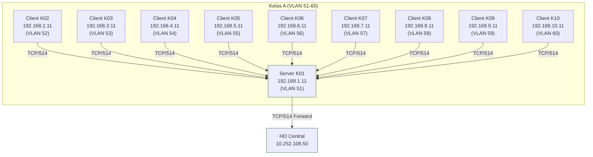

# MINGGU 7: Centralized Logging dengan Rsyslog

**Tujuan Pembelajaran**: Mahasiswa mampu mengimplementasikan sistem logging terpusat menggunakan rsyslog dengan konfigurasi TCP, template dinamis, forwarder, dan rotasi log otomatis untuk simulasi enterprise network. [perplexity]
## Kompetensi Dasar
Pada akhir praktikum, mahasiswa diharapkan:  
- Mengonfigurasi rsyslog sebagai server dan client dengan protokol TCP untuk reliabilitas tinggi.  
- Menerapkan template logging berbasis hostname/program untuk organisasi direktori terstruktur.  
- Mengintegrasikan forwarder ke central HO server untuk agregasi log skala besar.  
- Mengelola rotasi dan kompresi log menggunakan logrotate guna optimalisasi storage. [tecmint](https://www.tecmint.com/install-rsyslog-centralized-logging-in-centos-ubuntu/)

## Topologi Jaringan Lab
Lab menggunakan skema hierarchical 2-tier:  
- **Backbone WAN**: 10.252.108.0/24 (CSS326-24G-2S+RM @10.252.108.4, DNS @10.252.108.10).  
- **VLAN Kelas**: 51-60 (A), 61-70 (B), 71-80 (C), 81-90 (D).  
- **Level 1**: Local rsyslog server per kelas (misal K01: 192.168.1.11).  
- **Level 2**: HO Central Server 10.252.108.50.




## Urutan Port CSS326 Standar
- **P1-P2**: Reserved (Internet GW, spare/management).  
- **P3**: K01 (.151)  
- **P4**: K02 (.152)  
- **P5**: K03 (.153)  
- ...  
- **P12**: K10 (.160)  
- **P13-P24**: Trunk/overflow untuk Kelas B/C/D via VLAN atau daisy-chain RB3011 (Proxmox .161-.190 shared). [perplexity](https://www.perplexity.ai/search/a9e6e6ed-8292-4a19-9d1c-83aa27dee115)

## Tabel 40 Kelompok (Port CSS326 Konsisten P3-P12)
| Kelas | K | VLAN | VM IP          | Prox PC | **CSS Port** | Tugas              | Target            | Test Msg       |
|-------|---|------|----------------|---------|--------------|--------------------|-------------------|----------------|
| A |01| 51  |192.168.1.11   |.151    |**P3**       |SERVER A +HO fwd   |10.252.108.50     |TEST-M7-KA01  |
| A     |02| 52  |192.168.2.11   |.152    |**P4**       |Client→K01        |192.168.1.11      |TEST-M7-KA02  |
| A     |03| 53  |192.168.3.11   |.153    |**P5**       |Client→K01        |192.168.1.11      |TEST-M7-KA03  |
| A     |04| 54  |192.168.4.11   |.154    |**P6**       |Client→K01        |192.168.1.11      |TEST-M7-KA04  |
| A     |05| 55  |192.168.5.11   |.155    |**P7**       |Client→K01        |192.168.1.11      |TEST-M7-KA05  |
| A     |06| 56  |192.168.6.11   |.156    |**P8**       |Client→K01        |192.168.1.11      |TEST-M7-KA06  |
| A     |07| 57  |192.168.7.11   |.157    |**P9**       |Client→K01        |192.168.1.11      |TEST-M7-KA07  |
| A     |08| 58  |192.168.8.11   |.158    |**P10**      |Client→K01        |192.168.1.11      |TEST-M7-KA08  |
| A     |09| 59  |192.168.9.11   |.159    |**P11**      |Client→K01        |192.168.1.11      |TEST-M7-KA09  |
| A     |10| 60  |192.168.10.11  |.160    |**P12**      |Client→K01        |192.168.1.11      |TEST-M7-KA10  |
| B     |11| 61  |192.168.11.11  |.161    |**P3**       |SERVER B +HO fwd   |10.252.108.50     |TEST-M7-KB11  |
| B     |12| 62  |192.168.12.11  |.162    |**P4**       |Client→K11        |192.168.11.11     |TEST-M7-KB12  |
| *(Pattern identik untuk B11-P3 Server, C21-P3 Server, D31-P3 Server)*| | | | | | | | 


## Petunjuk Teknis Umum
- Semua VM: Ubuntu Server 24.04 LTS, akses via SSH dari Proxmox console.  
- Firewall: `sudo ufw --force enable && sudo ufw allow ssh && sudo ufw allow 514/tcp`.  
- Test log: `logger "TEST-M7-[KODE-KELAS-KELOMPOK] dari $(hostname -s)"`. 

## Langkah-langkah Praktikum

### A. Persiapan VM (Semua Kelompok - 10 menit)
```
1. Login Proxmox → Console VM sesuai tabel
2. sudo apt update && apt install rsyslog ufw -y
3. sudo ufw allow 22 && sudo ufw allow 514/tcp
4. sudo systemctl enable --now rsyslog ufw
```

### B. Konfigurasi SERVER Rsyslog (K01/K11/K21/K31 P3 - 25 menit)
```
nano /etc/rsyslog.conf  # Uncomment/add:
module(load="imtcp")
input(type="imtcp" port="514")

# VLAN Template (M2-enhanced)
$template VLANRemote,"/var/log/remote/vlan%vlanid%/%HOSTNAME%/%PROGRAMNAME%.log"
$DirCreate_datalvl 3
$FileOwner syslog $FileGroup adm

*.* ?VLANRemote
& stop

# HO Forward
*.info @@10.252.108.50:514

# Apply
sudo mkdir -p /var/log/remote/vlan51/k01
sudo systemctl restart rsyslog
sudo rsyslogd -N1
```

### C. Konfigurasi CLIENT Rsyslog (K02-K10 P4-P12 - 20 menit)
```
nano /etc/rsyslog.d/10-client.conf:
*.* @@192.168.1.11:514  # IP server kelas

sudo systemctl restart rsyslog
```

### D. Testing End-to-End (20 menit)
```
# Client test (jalankan 3x client berbeda)
logger "TEST-M7-KA02 dari $(hostname -s) VLAN52"

# Server verify
sudo find /var/log/remote -type f -exec grep "TEST-M7-KA" {} \;
sudo tail -f /var/log/remote/vlan52/k02/syslog

# HO verify (bonus)
ssh ho-admin "grep TEST-M7 /var/log/syslog"
```

### E. Logrotate Implementation (15 menit)
```
nano /etc/logrotate.d/rsyslog-vlan:
/var/log/remote/vlan*/*/*.log {
    daily rotate 56 compress
    postrotate /usr/lib/rsyslog/rsyslog-rotate; systemctl reload rsyslog; endscript
}

sudo logrotate -f /etc/logrotate.d/rsyslog-vlan
ls -la /var/log/remote/*/*.gz
```

### F. Dokumentasi (10 menit)
Screenshot 8 item → PDF laporan.

## Pertanyaan Setelah Praktikum
1. Verifikasi struktur `/var/log/remote/vlan51/k01/` - mengapa `%vlanid%` penting?  
2. Output `rsyslogd -N1` dan `tcpdump port 514` - apa temuan?  
3. Logrotate hasil - ukuran penghematan disk?  
4. Jika HO 10.252.108.50 down, impact apa ke local logging?  
5. Rancang policy routing (M2) khusus traffic syslog VLAN51 → WAN prioritas? [perplexity](https://www.perplexity.ai/search/fe0a17bc-91ae-4cfe-b449-4e65008aec4a)

## Checklist Verifikasi
```
PRE [ ] VLAN active: ip link show vlan51
PRE [ ] Firewall: ufw status 514/tcp ALLOW

SERVER [ ] rsyslogd -N1 = OK
SERVER [ ] netstat -tulpn | grep 514 = LISTEN TCP
SERVER [ ] mkdir /var/log/remote/vlan51/ = SUCCESS

CLIENT [ ] 9x logger TEST-M7 → server logs visible
CLIENT [ ] tail -f /var/log/remote/vlanXX/kXX/syslog = REAL-TIME

FORWARD [ ] HO grep TEST-M7 = 9+ entries per kelas
ROTATE [ ] ls *.gz = FILES EXIST
ROTATE [ ] logrotate -d = NO ERRORS

SUBMIT [ ] 8 screenshots PDF <20MB
```

## Kriteria Keberhasilan & Dokumentasi Laporan
**Checklist Wajib (Submit via GitHub Classroom)**:  
- [ ] Rsyslog server kelas listen TCP/514 (`netstat`).  
- [ ] Struktur `/var/log/remote/[hostname]/[program].log` terbentuk dari 9 client.  
- [ ] Forward berhasil ke HO (cek di 10.252.108.50).  
- [ ] Logrotate hasil kompresi (.gz files).  
- [ ] `rsyslogd -N1` output OK.  

**Screenshot Wajib (6 buah)**:  
1. Konfigurasi template `/etc/rsyslog.conf`.  
2. Output `rsyslogd -N1`.  
3. `netstat -tulpn | grep 514`.  
4. Struktur `/var/log/remote/` dengan test logs dari 3+ client.  
5. Hasil `find /var/log/remote -name "*.gz"`.  
6. Log forward di HO server. 

## Diskusi & Evaluasi
1. Mengapa menggunakan TCP daripada UDP untuk pengiriman log kritis? Jelaskan risiko packet loss pada UDP. [crowdstrike](https://www.crowdstrike.com/en-us/guides/syslog-logging/working-with-syslog-ng/)
2. Bagaimana template rsyslog (`%HOSTNAME%/%PROGRAMNAME%`) mendukung skalabilitas di environment multi-host?  
3. Rancang kebijakan rotasi log untuk sistem dengan 1TB logs/hari, pertimbangkan audit compliance dan disk usage.  
4. Jelaskan integrasi rsyslog dengan ELK Stack (Elasticsearch, Logstash, Kibana) secara konseptual.  
5. Analisis fault tolerance: Apa dampak jika HO server down pada arsitektur 2-tier ini? [centron](https://www.centron.de/en/tutorial/manage-linux-system-logs-with-rsyslog-full-guide/)

**Nilai Praktikum**: 100 poin (Checklist 70%, Screenshot 20%, Diskusi 10%).  

