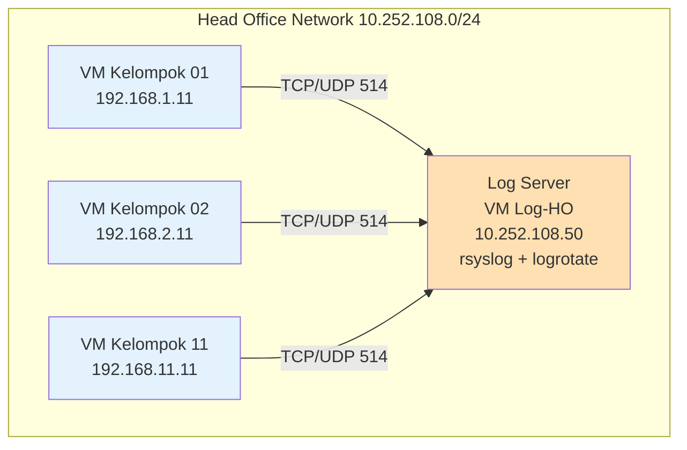

# MINGGU 7 - Centralized Logging dengan Rsyslog & Logrotate

## Tujuan Pembelajaran

Setelah menyelesaikan praktikum Minggu 7, mahasiswa diharapkan mampu:

1. Menjelaskan konsep **centralized logging** pada lingkungan enterprise.  
2. Mengkonfigurasi **rsyslog** sebagai log server dan log client pada Ubuntu Server 24.04. [howtoforge](https://www.howtoforge.com/how-to-setup-rsyslog-server-on-ubuntu-24-04/)
3. Mengirim log sistem (auth, syslog, kernel) dari VM client ke log server terpusat. [server-world](https://www.server-world.info/en/note?os=Ubuntu_24.04&p=rsyslog)
4. Menganalisis log hasil pengiriman untuk kebutuhan monitoring dan audit keamanan. [prowse](https://prowse.tech/setting-up-an-rsyslog-server-in-linux/)
5. Menggunakan **logrotate** untuk rotasi, kompresi, dan retensi log secara otomatis. [signoz](https://signoz.io/guides/logrotate-linux/)
6. Menyusun kebijakan dasar retensi log (berapa lama disimpan, ukuran maksimal, kompresi). [dash0](https://www.dash0.com/guides/log-rotation-linux-logrotate)
7. Menyusun laporan praktikum dengan cuplikan konfigurasi dan contoh potongan log insiden.

***

## Deskripsi Praktikum

Pada Minggu 7, setiap kelas akan membangun skenario **centralized logging** sederhana:

- Satu VM per kelas bertindak sebagai **Rsyslog Server** (log collector). [howtoforge](https://www.howtoforge.com/how-to-setup-rsyslog-server-on-ubuntu-24-04/)
- Minimal satu VM lain per kelompok sebagai **Rsyslog Client** (log sender). [youtube](https://www.youtube.com/watch?v=1gRA1bm1tSs)
- Log yang dikirim mencakup: `auth.log`, `syslog`, dan log firewall (jika ada). [server-world](https://www.server-world.info/en/note?os=Ubuntu_24.04&p=rsyslog&f=1)
- Log server menyimpan log per-host dan per-program dalam struktur direktori terpisah. [youtube](https://www.youtube.com/watch?v=yzpDxi8cxSo)
- Logrotate diaktifkan untuk mencegah penggunaan disk berlebih, dengan rotasi mingguan dan kompresi. [redhat](https://www.redhat.com/en/blog/setting-logrotate)

Fokus utama adalah pemahaman alur log: dari sistem sumber (client) → rsyslog client → jaringan → rsyslog server → file log yang terstruktur.

***

## Topologi Log Server



***

## Langkah 1: Persiapan Rsyslog Server (30 menit)

Pilih satu VM khusus di Head Office (misal IP `10.252.108.50`) sebagai **log server**.

### 1.1 Verifikasi dan Aktivasi Rsyslog

```bash
# Pastikan rsyslog terpasang dan aktif
sudo apt update
sudo apt install rsyslog -y

sudo systemctl status rsyslog
sudo systemctl enable rsyslog
```

### 1.2 Konfigurasi Rsyslog sebagai Log Server

Buka konfigurasi utama:

```bash
sudo nano /etc/rsyslog.conf
```

Aktifkan input UDP dan TCP (hapus tanda komentar pada baris terkait):

```conf
module(load="imudp")
input(type="imudp" port="514")

module(load="imtcp")
input(type="imtcp" port="514")

# Batasi sumber yang diizinkan
$AllowedSender TCP, 127.0.0.1, 10.252.108.0/24, 192.168.0.0/16
$AllowedSender UDP, 127.0.0.1, 10.252.108.0/24, 192.168.0.0/16
```

Tambahkan template penyimpanan log per host:

```conf
# Template direktori log per host dan per program
$template remote-incoming-logs,"/var/log/remote/%HOSTNAME%/%PROGRAMNAME%.log"

*.* ?remote-incoming-logs
```

Simpan file, kemudian restart layanan:

```bash
sudo rsyslogd -f /etc/rsyslog.conf -N1   # uji sintaks
sudo systemctl restart rsyslog
sudo netstat -tulnp | grep 514           # pastikan port 514 TCP/UDP terbuka
```

***

## Langkah 2: Konfigurasi Rsyslog Client (30 menit)

Pada VM tiap kelompok (misal `192.168.X.11`), konfigurasikan sebagai **client** yang mengirim log ke server.

### 2.1 Pastikan Rsyslog Aktif

```bash
sudo apt install rsyslog -y
sudo systemctl enable --now rsyslog
```

### 2.2 Konfigurasi Forwarding Log ke Server

Buat file konfigurasi khusus:

```bash
sudo nano /etc/rsyslog.d/90-remote.conf
```

Isi dengan konfigurasi berikut:

```conf
# Kirim semua log ke log server via TCP
*.*  action(
       type="omfwd"
       target="10.252.108.50"
       port="514"
       protocol="tcp"
       queue.filename="fwdRule-remote"
       queue.maxdiskspace="100m"
       queue.saveonshutdown="on"
       queue.type="LinkedList"
       action.resumeRetryCount="-1"
     )
```

Simpan dan restart:

```bash
sudo systemctl restart rsyslog
```

### 2.3 Uji Pengiriman Log

Pada client:

```bash
logger "TEST-M7: Pesan uji dari kelompok $(hostname)"
```

Pada server:

```bash
sudo find /var/log/remote -type f
sudo grep "TEST-M7" -R /var/log/remote/
```

Jika pesan uji muncul di log server, konfigurasi client–server sudah benar. [server-world](https://www.server-world.info/en/note?os=Ubuntu_24.04&p=rsyslog&f=1)

***

## Langkah 3: Struktur dan Analisis Log (20 menit)

Mahasiswa diminta mengamati struktur direktori yang terbentuk di log server:

```bash
sudo tree /var/log/remote | head
sudo ls -R /var/log/remote
```

Contoh struktur yang diharapkan:

```text
/var/log/remote/
 ├── vm-k01
 │   ├── sshd.log
 │   ├── cron.log
 │   └── systemd.log
 └── vm-k02
     ├── sshd.log
     └── auth.log
```

Tugas analisis:

- Cari baris log ketika terjadi login SSH ke salah satu VM.  
- Identifikasi field waktu, hostname, service, dan pesan; tulis contoh di laporan.  

***

## Langkah 4: Konfigurasi Logrotate untuk Log Remote (25 menit)

Agar log tidak memenuhi disk, gunakan **logrotate** untuk rotasi otomatis. [signoz](https://signoz.io/guides/logrotate-linux/)

### 4.1 Verifikasi Logrotate

```bash
sudo apt install logrotate -y
logrotate --version
```

### 4.2 Tambah Rule Khusus untuk Remote Logs

Buat file konfigurasi:

```bash
sudo nano /etc/logrotate.d/remote-logs
```

Isi:

```conf
/var/log/remote/*/*.log {
    weekly
    rotate 4
    compress
    delaycompress
    missingok
    notifempty
    create 0640 syslog adm
    sharedscripts
    postrotate
        systemctl reload rsyslog >/dev/null 2>&1 || true
    endscript
}
```

Penjelasan singkat (untuk laporan):

- `weekly`: rotasi setiap minggu. [redhat](https://www.redhat.com/en/blog/setting-logrotate)
- `rotate 4`: menyimpan 4 arsip (maks. 1 bulan jika mingguan). [signoz](https://signoz.io/guides/logrotate-linux/)
- `compress`: arsip lama dikompresi (hemat ruang). [dash0](https://www.dash0.com/guides/log-rotation-linux-logrotate)

### 4.3 Uji Konfigurasi Logrotate

```bash
sudo logrotate -d /etc/logrotate.conf      # mode debug
sudo logrotate -f /etc/logrotate.conf      # paksa rotasi (untuk percobaan)
ls -l /var/log/remote/*/
```

Mahasiswa diminta menyertakan screenshot sebelum–sesudah rotasi dalam laporan.

***

## Checklist Penilaian

- [ ] Rsyslog server (`10.252.108.50`) menerima log di `/var/log/remote/...`. [howtoforge](https://www.howtoforge.com/how-to-setup-rsyslog-server-on-ubuntu-24-04/)
- [ ] Minimal 1 client per kelompok mengirim log ke server. [server-world](https://www.server-world.info/en/note?os=Ubuntu_24.04&p=rsyslog&f=1)
- [ ] Pesan `logger "TEST-M7..."` muncul di log server.  
- [ ] Struktur direktori per-host dan per-program terbentuk dengan benar.  
- [ ] Logrotate terpasang dan rule `remote-logs` aktif. [signoz](https://signoz.io/guides/logrotate-linux/)
- [ ] Hasil rotasi log (file `.gz`) terbentuk setelah uji `logrotate -f`.  
- [ ] Laporan memuat contoh potongan log dan interpretasi isinya.  

***

## Troubleshooting Umum

| Masalah | Diagnosis | Solusi |
|--------|-----------|--------|
| Log tidak sampai ke server | Port 514 tertutup atau rsyslog di server mati | Cek `sudo systemctl status rsyslog`, `sudo netstat -tulnp | grep 514` di server.  [howtoforge](https://www.howtoforge.com/how-to-setup-rsyslog-server-on-ubuntu-24-04/) |
| File di `/var/log/remote` tidak muncul | Template salah atau rule tidak dieksekusi | Cek isi `/etc/rsyslog.conf`, pastikan `*.* ?remote-incoming-logs` aktif.  [server-world](https://www.server-world.info/en/note?os=Ubuntu_24.04&p=rsyslog&f=1) |
| Client error saat restart rsyslog | Sintaks file `/etc/rsyslog.d/90-remote.conf` salah | Jalankan `rsyslogd -N1` di client untuk uji sintaks.  [server-world](https://www.server-world.info/en/note?os=Ubuntu_24.04&p=rsyslog) |
| Logrotate tidak memutar file | Pola path tidak cocok | Pastikan path `/var/log/remote/*/*.log` benar dan file tidak kosong.  [signoz](https://signoz.io/guides/logrotate-linux/) |
| Disk hampir penuh | Banyak log lama tanpa kompresi | Pastikan `compress` aktif dan `rotate` tidak terlalu besar, atau hapus arsip lama secara manual.  [redhat](https://www.redhat.com/en/blog/setting-logrotate) |

***

## Pertanyaan Evaluasi

1. Jelaskan keuntungan **centralized logging** dibandingkan log lokal per server dalam konteks keamanan dan audit. [prowse](https://prowse.tech/setting-up-an-rsyslog-server-in-linux/)
2. Mengapa disarankan menggunakan **TCP** untuk pengiriman log kritis dibanding UDP? Jelaskan risiko kehilangan log. [howtoforge](https://www.howtoforge.com/how-to-setup-rsyslog-server-on-ubuntu-24-04/)
3. Jelaskan fungsi **template** pada rsyslog dan berikan contoh struktur direktori log yang baik untuk enterprise. [server-world](https://www.server-world.info/en/note?os=Ubuntu_24.04&p=rsyslog&f=1)
4. Rancang kebijakan rotasi log untuk sistem dengan beban tinggi agar menjaga keseimbangan antara kebutuhan audit dan kapasitas disk. [redhat](https://www.redhat.com/en/blog/setting-logrotate)
5. Bagaimana mengintegrasikan rsyslog dengan sistem visualisasi log (misalnya ELK / Grafana Loki) secara garis besar? [youtube](https://www.youtube.com/watch?v=i7zaHPnfJCA)

***

**End of MINGGU_7_CENTRALIZED_LOGGING.md**
